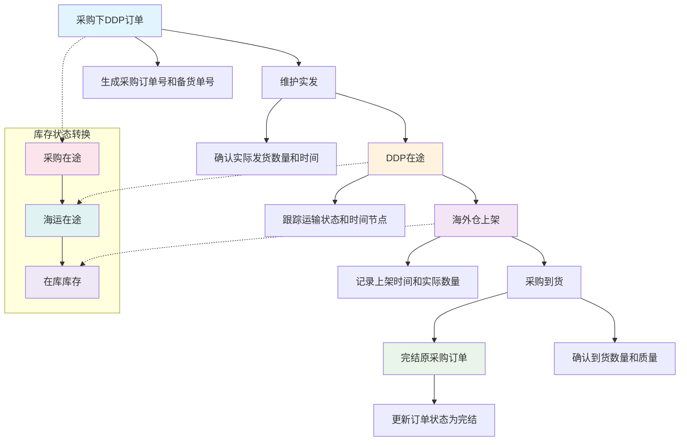
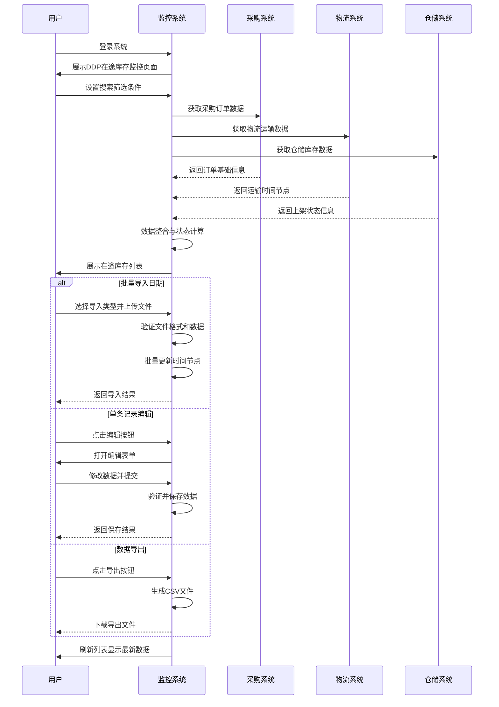
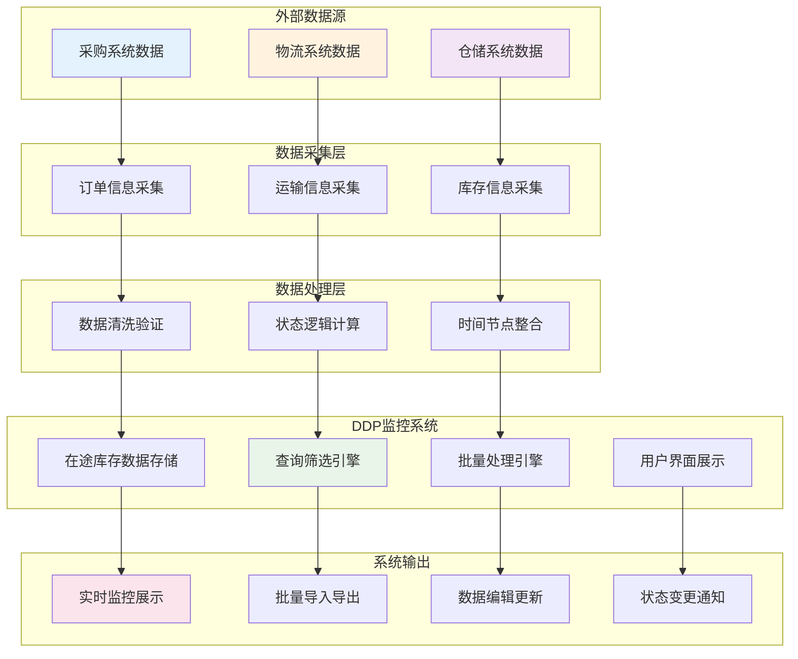
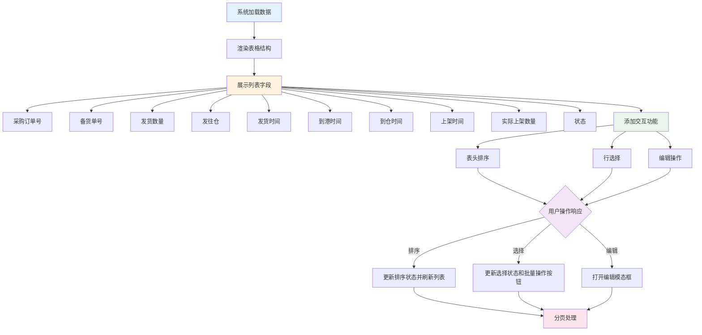
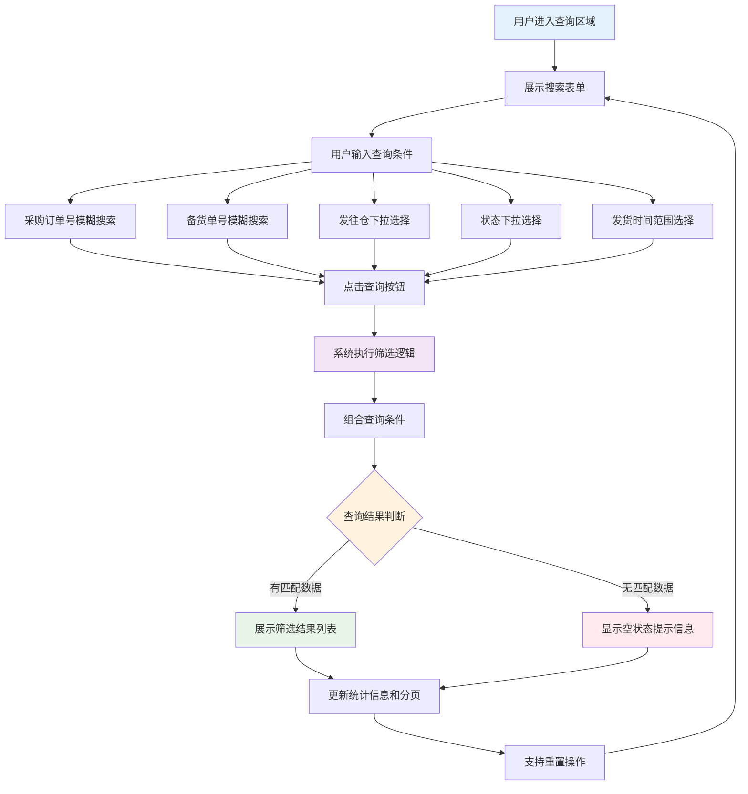
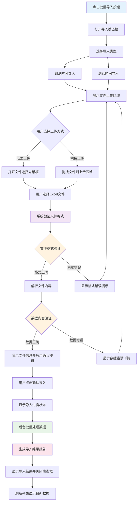

| 修订目录 | | | |
| --- | --- | --- | --- |
| 修订时间 | 修订版本 | 修订人 | 修订说明 |
| 2024.09.17 | V1.0 | 产品团队 | 新增版本V1.0 |

## **一、背景**

随着跨境电商业务的快速发展，DDP（Delivered Duty Paid）模式下的供应链管理日趋复杂。企业需要对从采购订单下达到海外仓上架的全链路进行精确管控。

当前业务流程为：采购下DDP订单——维护实发——DDP在途——海外仓上架——采购到货——完结原采购订单。在此过程中，库存状态经历采购在途——海运在途——在库库存的转换。

现有管理方式存在以下问题：
1. 各环节信息分散，缺乏统一的监控平台
2. 时间节点信息录入效率低下，容易出错
3. 无法实时掌握货物状态，影响业务决策
4. 缺乏批量数据处理能力，影响操作效率

为解决上述问题，需要构建DDP在途库存监控系统，实现全流程可视化管理，提升供应链运营效率。

## **二、业务名词**

| 业务名词 | 名词说明 |
| :--- | :--- |
| DDP | Delivered Duty Paid，完税后交货模式，卖方承担到指定地点的所有费用和风险 |
| 采购订单号 | 企业采购系统生成的采购指令唯一标识 |
| 备货单号 | 根据采购订单生成的仓库备货作业指导单据编号 |
| 发货数量 | 实际从供应商处发出的货物数量 |
| 发往仓 | 货物的目标配送仓库，如美国加州仓、德国柏林仓等 |
| 发货时间 | 货物从供应商处实际发出的时间节点 |
| 到港时间 | 货物运输到达目的港口的时间节点 |
| 到仓时间 | 货物从港口运输到海外仓库的时间节点 |
| 上架时间 | 货物在海外仓完成入库检验并上架的时间节点 |
| 实际上架数量 | 货物完成上架后的实际入库数量，可能因损耗等与发货数量存在差异 |
| 在途中 | 货物已发出但尚未完成海外仓上架的状态 |
| 已上架 | 货物已到达海外仓并完成上架作业的状态 |
| 已取消 | 采购订单被取消，货物停止配送的状态 |

## **三、流程图**

### **1、业务流程图**

### **2、系统流程图**

### **3、数据流程图**

## **四、功能需求清单**

| 功能模块 | 功能目的 | 模块功能点 | 优先级 |
| :--- | :--- | :--- | :--- |
| 在途库存管理列表 | 提供完整的在途库存信息展示和管理，解决信息分散查看不便的问题 | 列表字段展示 数据排序 分页浏览 状态标签 选择操作 | P0 |
| 搜索筛选功能 | 提供多维度快速查询能力，解决大数据量中精准定位目标记录的问题 | 采购订单号搜索 备货单号搜索 发往仓筛选 状态筛选 发货时间范围筛选 重置查询条件 | P0 |
| 批量导入日期 | 提供高效的批量时间节点录入能力，解决手工录入效率低下和易出错的问题 | 到港时间导入 到仓时间导入 Excel文件处理 数据格式验证 导入模板下载 | P1 |
| 数据编辑功能 | 提供灵活的单条记录维护能力，解决数据更新和状态变更的需求 | 单条记录编辑 时间节点修改 实际数量更新 状态变更 数据验证保存 | P1 |
| 数据导出功能 | 提供数据导出和外部分析支持，解决数据共享和业务分析的需求 | CSV格式导出 筛选数据导出 文件下载 | P2 |

## **五、功能性需求说明**

### 在途库存管理列表

#### （1）功能流程

#### （2）交互说明

针对在途库存管理列表的相关交互细节进行补充说明：

- 表格支持按列排序功能，点击表头可在升序、降序、默认顺序间切换，数值和日期字段优先支持排序
- 每行提供复选框选择功能，支持单选、多选和全选操作，选中状态会影响批量操作按钮的可用性
- 状态字段使用彩色标签进行可视化区分：在途中（橙色背景）、已上架（绿色背景）、已取消（红色背景）
- 每行末尾提供编辑操作按钮，点击后弹出模态框进行单条记录的修改操作
- 表格底部提供分页器，支持页码跳转和每页显示数量调整，默认每页显示10条记录
- 时间字段为空时显示"-"，确保界面显示的一致性和美观性

#### （3）字段说明

| 字段名称 | 类型 | 字段要求 | 取值范围/枚举值 | 是否必填 | 默认值 | 业务含义 | 备注 |
| --- | --- | --- | --- | --- | --- | --- | --- |
| 选择框 | 布尔 | 支持用户选择 | true/false | - | false | 用于标识当前行是否被选中 | 批量操作的前置条件 |
| 采购订单号 | 文本 | 只读显示 | 字符串格式 | 是 | - | 采购系统生成的订单唯一标识 | 支持排序和搜索 |
| 备货单号 | 文本 | 只读显示 | 字符串格式 | 是 | - | 仓储系统生成的备货单编号 | 支持排序和搜索 |
| 发货数量 | 数值 | 只读显示 | 正整数 | 是 | - | 实际从供应商发出的货物数量 | 支持排序，单位为件 |
| 发往仓 | 文本 | 只读显示 | 仓库中文名称 | 是 | - | 货物的目标配送仓库名称 | 显示友好的中文名称 |
| 发货时间 | 日期 | 只读显示 | YYYY-MM-DD格式 | 是 | - | 货物从供应商实际发出的时间 | 支持排序和时间筛选 |
| 到港时间 | 日期 | 可为空 | YYYY-MM-DD格式 | 否 | - | 货物到达目的港口的时间 | 支持排序，空值显示"-" |
| 到仓时间 | 日期 | 可为空 | YYYY-MM-DD格式 | 否 | - | 货物到达海外仓库的时间 | 支持排序，空值显示"-" |
| 上架时间 | 日期 | 可为空 | YYYY-MM-DD格式 | 否 | - | 货物完成上架作业的时间 | 支持排序，空值显示"-" |
| 实际上架数量 | 数值 | 可为空 | 非负整数 | 否 | 0 | 实际入库上架的货物数量 | 支持排序，可能小于发货数量 |
| 状态 | 枚举 | 彩色标签 | 在途中/已上架/已取消 | 是 | 在途中 | 货物当前的处理状态 | 不同状态使用不同颜色标识 |
| 操作 | 按钮 | 固定显示 | 编辑按钮 | - | - | 提供单条记录编辑功能的入口 | 点击打开编辑模态框 |

### 搜索筛选功能

#### （1）功能流程

#### （2）交互说明

针对搜索筛选功能的相关交互细节进行补充说明：

- 采购订单号和备货单号支持模糊匹配搜索，用户输入部分关键字即可匹配包含该关键字的所有记录
- 发往仓筛选提供下拉选择框，包含"美国加州仓"、"美国德州仓"、"英国伦敦仓"、"德国柏林仓"等选项，以及"全部"选项
- 状态筛选提供下拉选择框，包含"在途中"、"已上架"、"已取消"三个状态选项，以及"全部"选项
- 发货时间支持日期范围筛选，提供起始时间和结束时间两个日期选择器，支持选择具体日期或日期范围
- 查询条件支持单独使用或任意组合使用，系统会对所有条件进行AND逻辑组合筛选
- 查询结果会实时更新表格内容、总记录数统计信息和分页器状态
- 重置按钮可一键清空所有查询条件，快速恢复到显示全部数据的默认状态

#### （3）字段说明

| 字段名称 | 类型 | 字段要求 | 取值范围/枚举值 | 是否必填 | 默认值 | 业务含义 | 备注 |
| --- | --- | --- | --- | --- | --- | --- | --- |
| 采购订单号 | 文本 | 支持模糊匹配 | 字符串，部分匹配 | 否 | 空字符串 | 按采购订单号进行筛选 | 不区分大小写 |
| 备货单号 | 文本 | 支持模糊匹配 | 字符串，部分匹配 | 否 | 空字符串 | 按备货单号进行筛选 | 不区分大小写 |
| 发往仓 | 枚举 | 下拉单选 | US-CA/US-TX/UK-LON/DE-BER/全部 | 否 | 全部 | 按目标仓库进行筛选 | 显示中文友好名称 |
| 状态 | 枚举 | 下拉单选 | 在途中/已上架/已取消/全部 | 否 | 全部 | 按处理状态进行筛选 | 精确匹配状态值 |
| 发货开始时间 | 日期 | 日期选择器 | YYYY-MM-DD格式 | 否 | 空 | 发货时间范围筛选的起始日期 | 包含当天的数据 |
| 发货结束时间 | 日期 | 日期选择器 | YYYY-MM-DD格式 | 否 | 空 | 发货时间范围筛选的结束日期 | 包含当天的数据 |

### 批量导入日期

#### （1）功能流程

#### （2）交互说明

针对批量导入日期功能的相关交互细节进行补充说明：

- 导入类型通过单选按钮组选择，支持"到港时间"和"到仓时间"两种类型，用户必须先选择类型再上传文件
- 文件上传支持点击上传和拖拽上传两种方式，上传区域提供清晰的视觉提示和操作指引
- 系统严格验证文件格式，仅支持.xlsx和.xls格式的Excel文件，其他格式会显示具体的错误提示信息
- 提供标准导入模板下载功能，用户可点击下载链接获取包含正确格式示例的Excel模板文件
- 文件上传成功后显示文件名、文件大小等基本信息，同时启用"确认导入"按钮供用户确认
- 导入过程显示进度条和加载动画，让用户了解当前处理状态，避免重复操作
- 导入完成后显示详细的结果报告，包括成功导入的记录数、失败记录数及失败原因说明

#### （3）字段说明

| 字段名称 | 类型 | 字段要求 | 取值范围/枚举值 | 是否必填 | 默认值 | 业务含义 | 备注 |
| --- | --- | --- | --- | --- | --- | --- | --- |
| 导入类型 | 枚举 | 单选按钮组 | 到港时间/到仓时间 | 是 | 到港时间 | 指定本次导入的时间数据类型 | 影响数据处理和验证逻辑 |
| 上传文件 | 文件 | 格式验证 | .xlsx/.xls格式 | 是 | - | 包含时间数据的Excel工作表文件 | 文件大小限制10MB以内 |
| 文件名称 | 文本 | 自动识别 | 上传文件的原始名称 | - | - | 显示用户选择的文件名称 | 只读显示，用于用户确认 |
| 文件大小 | 数值 | 自动计算 | 以KB或MB为单位 | - | - | 显示上传文件的大小信息 | 只读显示，用于用户参考 |

## **六、非功能性需求说明**

### 1. 性能需求
- **页面响应时间**：系统首页加载时间不超过3秒，数据查询响应时间不超过2秒
- **并发处理能力**：支持50个用户同时在线操作，系统响应时间无明显增加
- **数据处理能力**：单次查询支持最大10000条记录展示，批量导入支持最大5000条记录处理
- **文件处理性能**：Excel文件导入处理时间不超过30秒，文件大小限制在10MB以内

### 2. 可用性需求
- **系统可用性**：系统整体可用性要求达到99.5%以上，确保业务连续性
- **故障恢复时间**：系统发生故障后，恢复正常服务的时间不超过1小时
- **用户体验**：界面操作简洁直观，新用户经过30分钟培训即可熟练使用主要功能

### 3. 安全性需求
- **数据传输安全**：系统采用HTTPS协议进行数据传输，确保数据在传输过程中的安全性
- **访问权限控制**：实现基于角色的访问控制，不同用户角色具有相应的操作权限
- **数据完整性保护**：关键操作记录操作日志，支持数据变更的追溯和审计

### 4. 兼容性需求
- **浏览器兼容性**：支持Chrome 60+、Firefox 55+、Safari 12+、Edge 79+等主流浏览器
- **操作系统兼容性**：支持Windows、macOS、Linux等主流操作系统
- **移动端适配**：提供响应式设计，支持平板电脑和智能手机的浏览器访问

### 5. 扩展性需求
- **数据规模扩展**：系统架构设计支持数据量从万级记录扩展到十万级记录
- **功能模块扩展**：采用模块化架构设计，便于后续功能模块的添加和扩展
- **系统集成扩展**：预留标准接口，支持与其他业务系统的数据交换和集成

### 6. 异常场景处理需求
- **网络异常处理**：当网络连接超时或中断时，系统显示友好的错误提示，并提供重试机制
- **文件上传异常**：文件格式不符合要求、文件损坏、文件过大等情况下，提供具体的错误说明和解决建议
- **数据冲突处理**：多用户同时编辑同一条记录时，采用最后提交者优先的策略，并提示用户数据冲突信息
- **业务逻辑异常**：对于数据格式错误、必填字段缺失等业务异常，系统阻止提交并提供明确的错误提示信息
