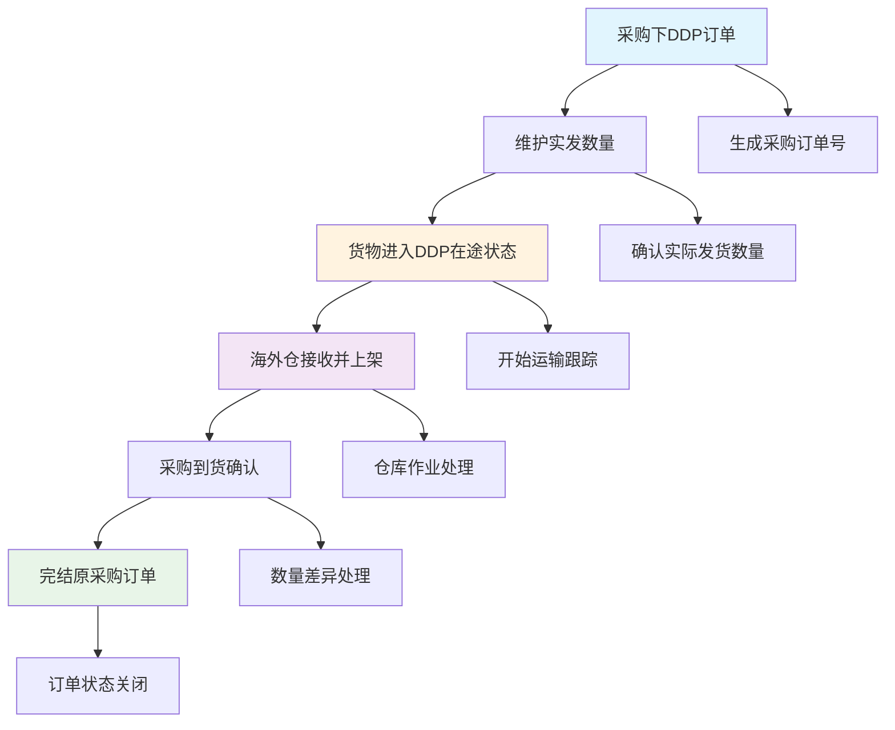
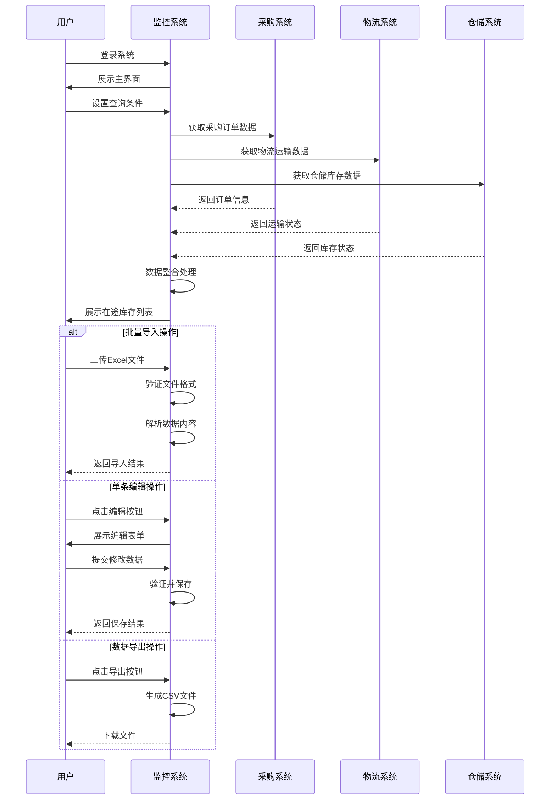
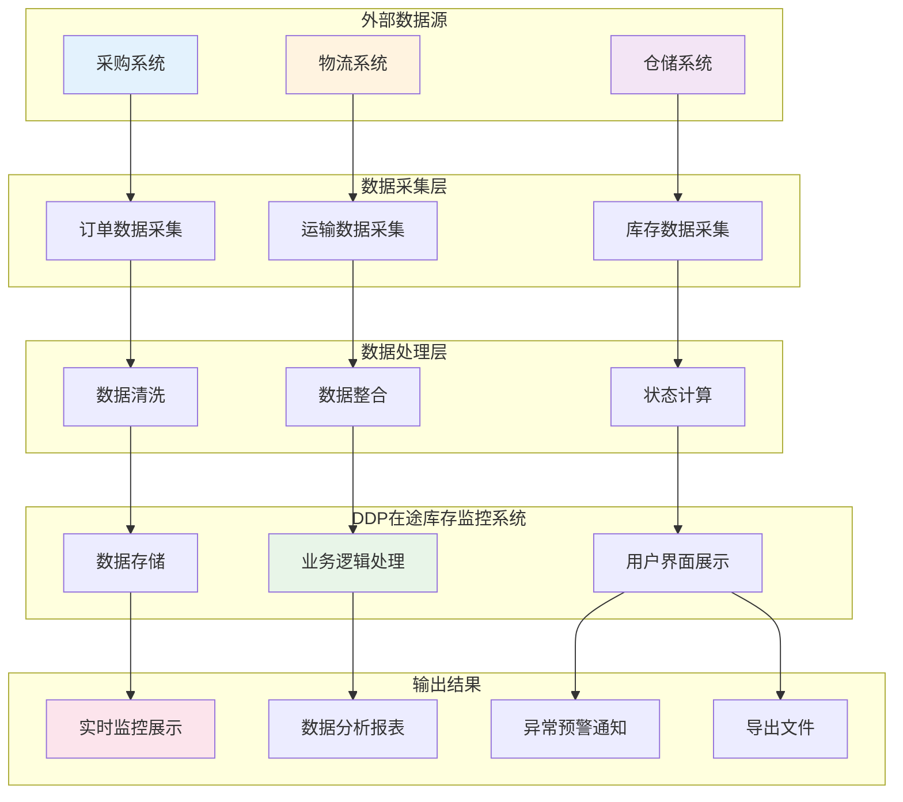
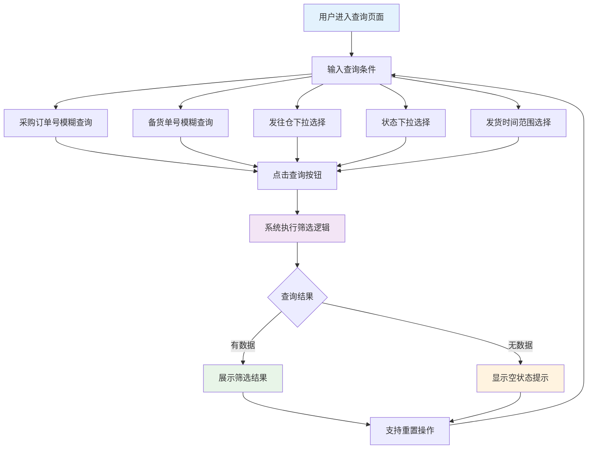
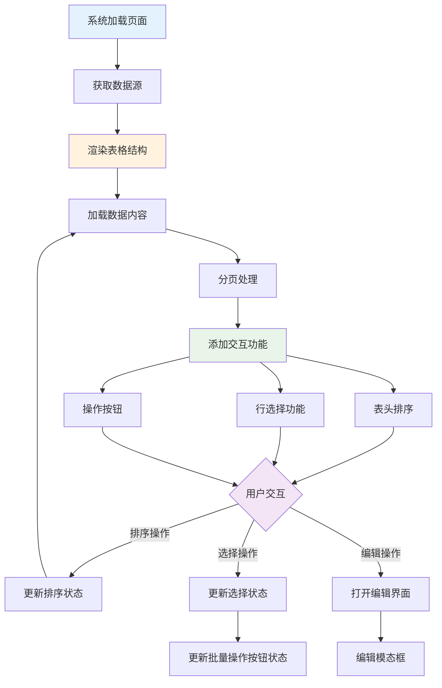
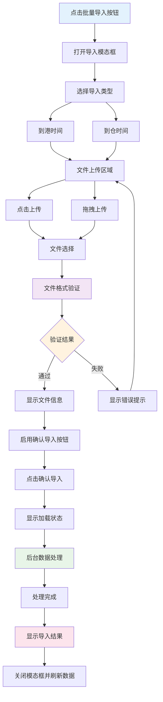
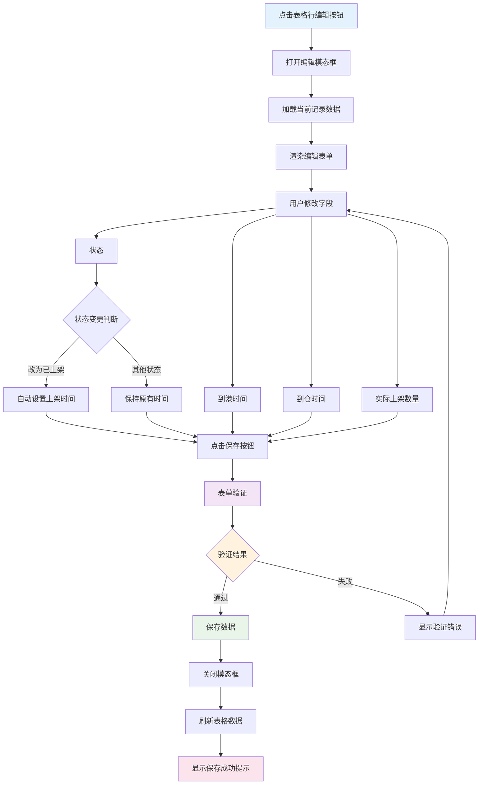
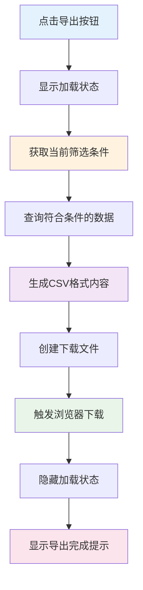

| 修订目录 | | | |
| --- | --- | --- | --- |
| 修订时间 | 修订版本 | 修订人 | 修订说明 |
| 2024.09.17 | V1.0 | AI助手 | 新增版本V1.0 |

## **一、背景**

随着跨境电商DDP业务的快速发展，企业亟需建立一套完整的在途库存监控体系。当前业务流程从采购下DDP订单开始，经过维护实发、DDP在途、海外仓上架、采购到货，最终完结原采购订单。在这个过程中，企业面临以下核心挑战：

1. **信息孤岛问题**：各个环节的时间节点信息分散在不同系统中，缺乏统一的监控平台
2. **数据录入效率低**：大量时间节点需要人工录入，容易出错且效率低下
3. **状态跟踪困难**：无法实时掌握货物从发出到上架的完整状态变化
4. **决策支持不足**：缺乏有效的数据分析和报表功能，影响业务决策

因此，需要建设DDP在途库存监控系统，实现从采购订单到海外仓上架的全流程可视化管理，提升库存管理效率，为业务决策提供有力支撑。

## **二、业务名词**

| 业务名词 | 名词说明 |
| :--- | :--- |
| DDP | Delivered Duty Paid，完税后交货模式，卖方承担运送到买方指定地点的所有费用和风险 |
| 采购订单 | 企业内部采购系统生成的采购指令单据，包含商品信息、数量、价格等关键信息 |
| 备货单 | 仓储管理系统根据采购订单生成的仓库作业指导单据 |
| 发往仓 | 货物的目标配送仓库，通常为海外仓库如美国仓、欧洲仓等 |
| 在途库存 | 已发出但尚未完成最终入库上架的货物库存状态 |
| 到港时间 | 货物运输到达目的港口的具体时间节点 |
| 到仓时间 | 货物从港口运输到达目标海外仓库的时间节点 |
| 上架时间 | 货物在海外仓完成入库检验并正式上架可销售的时间节点 |
| 实际上架数量 | 货物完成上架作业后的实际入库数量，可能因损耗等原因与发货数量存在差异 |

## **三、流程图**

### **1、业务流程图**

### **2、系统流程图**

### **3、数据流程图**

## **四、功能需求清单**

| 功能模块 | 功能目的 | 模块功能点 | 优先级 |
| :--- | :--- | :--- | :--- |
| 数据查询模块 | 提供多维度查询功能，解决数据检索效率问题 | 采购订单号搜索 备货单号搜索 发往仓筛选 状态筛选 时间范围筛选 重置查询条件 | P0 |
| 数据展示模块 | 提供完整的在途库存信息展示，解决信息可视化问题 | 表格数据展示 字段排序功能 分页浏览 状态标签显示 统计信息展示 | P0 |
| 数据编辑模块 | 提供灵活的数据修改功能，解决数据维护问题 | 单条记录编辑 时间节点修改 数量信息更新 状态变更 数据验证 | P0 |
| 批量操作模块 | 提供高效的批量处理功能，解决大量数据录入问题 | 批量导入日期 Excel文件上传 模板下载 导入验证 批量更新 | P1 |
| 数据导出模块 | 提供数据导出功能，解决外部系统集成和分析需求 | CSV格式导出 筛选结果导出 文件下载 | P1 |
| 系统界面模块 | 提供友好的用户交互界面，解决用户体验问题 | 响应式设计 操作反馈 加载状态显示 错误提示 | P2 |

## **五、功能性需求说明**

### 数据查询模块

#### （1）功能流程

#### （2）交互说明

- 查询条件支持单独使用或组合使用，提供灵活的查询方式
- 采购订单号和备货单号支持模糊匹配，提升查询便利性
- 发往仓和状态提供下拉选择，避免输入错误
- 时间范围选择支持日期选择器，提供直观的日期选择界面
- 查询结果实时更新表格内容和分页信息
- 重置功能一键清空所有查询条件，快速恢复默认状态

#### （3）字段说明

| 字段名称 | 类型 | 取值范围/枚举值 | 是否必填 | 默认值 | 业务含义 | 备注 |
| --- | --- | --- | --- | --- | --- | --- |
| 采购订单号 | 文本 | 字符串，支持模糊匹配 | 否 | 空 | 采购系统生成的唯一订单标识 | 支持部分字符匹配 |
| 备货单号 | 文本 | 字符串，支持模糊匹配 | 否 | 空 | 仓储系统生成的备货作业单号 | 支持部分字符匹配 |
| 发往仓 | 枚举 | US-CA,US-TX,UK-LON,DE-BER,全部 | 否 | 全部 | 目标海外仓库标识 | 下拉选择，默认显示全部 |
| 状态 | 枚举 | 在途中,已上架,已取消,全部 | 否 | 全部 | 货物当前处理状态 | 下拉选择，默认显示全部 |
| 发货开始时间 | 日期 | YYYY-MM-DD格式 | 否 | 空 | 查询时间范围的起始日期 | 日期选择器输入 |
| 发货结束时间 | 日期 | YYYY-MM-DD格式 | 否 | 空 | 查询时间范围的结束日期 | 日期选择器输入 |

### 数据展示模块

#### （1）功能流程

#### （2）交互说明

- 表格支持按列排序，点击表头实现升序/降序切换
- 支持全选和单选复选框，便于批量操作
- 每行提供编辑操作按钮，支持单条记录修改
- 分页器支持页码切换和每页显示数量调整
- 状态字段使用不同颜色的标签进行可视化区分
- 表格内容响应式设计，适配不同屏幕尺寸

#### （3）字段说明

| 字段名称 | 类型 | 取值范围/枚举值 | 是否必填 | 默认值 | 业务含义 | 备注 |
| --- | --- | --- | --- | --- | --- | --- |
| 选择框 | 布尔 | true/false | - | false | 行选择状态标识 | 支持全选和单选 |
| 采购订单号 | 文本 | 字符串 | 是 | - | 采购系统订单编号 | 只读显示，支持排序 |
| 备货单号 | 文本 | 字符串 | 是 | - | 仓储系统备货单编号 | 只读显示，支持排序 |
| 发货数量 | 数值 | 正整数 | 是 | - | 实际发出货物数量 | 只读显示，支持排序 |
| 发往仓 | 文本 | 仓库中文名称 | 是 | - | 目标仓库名称 | 只读显示 |
| 发货时间 | 日期 | YYYY-MM-DD | 是 | - | 货物发出时间 | 只读显示，支持排序 |
| 到港时间 | 日期 | YYYY-MM-DD | 否 | - | 到达港口时间 | 可为空显示"-"，支持排序 |
| 到仓时间 | 日期 | YYYY-MM-DD | 否 | - | 到达仓库时间 | 可为空显示"-"，支持排序 |
| 上架时间 | 日期 | YYYY-MM-DD | 否 | - | 完成上架时间 | 可为空显示"-"，支持排序 |
| 实际上架数量 | 数值 | 非负整数 | 否 | 0 | 实际入库数量 | 可为空显示"-"，支持排序 |
| 状态 | 枚举 | 在途中,已上架,已取消 | 是 | 在途中 | 货物处理状态 | 彩色标签显示 |
| 操作 | 按钮 | 编辑 | - | - | 操作功能入口 | 固定显示编辑按钮 |

### 批量操作模块

#### （1）功能流程

#### （2）交互说明

- 支持点击上传和拖拽上传两种文件选择方式
- 文件格式严格验证，仅支持Excel文件（.xlsx/.xls）
- 提供标准导入模板下载功能，确保数据格式正确
- 导入过程显示进度加载动画，提供操作反馈
- 导入完成后显示详细结果信息，包括成功和失败记录数
- 支持导入类型选择，灵活适应不同业务场景

#### （3）字段说明

| 字段名称 | 类型 | 取值范围/枚举值 | 是否必填 | 默认值 | 业务含义 | 备注 |
| --- | --- | --- | --- | --- | --- | --- |
| 导入类型 | 枚举 | 到港时间,到仓时间 | 是 | 到港时间 | 指定导入的时间数据类型 | 单选按钮选择 |
| 上传文件 | 文件 | .xlsx,.xls格式 | 是 | - | 包含时间数据的Excel文件 | 支持拖拽和点击上传 |
| 文件大小 | 数值 | ≤10MB | - | - | 上传文件的大小限制 | 系统自动检查 |

### 数据编辑模块

#### （1）功能流程

#### （2）交互说明

- 采购订单号和备货单号设为只读字段，确保数据完整性
- 日期字段提供日期选择器，支持快速日期选择
- 状态变更为"已上架"时系统自动设置上架时间为当前日期
- 表单提供完整的数据验证，确保数据格式正确
- 保存成功后自动关闭模态框并刷新表格显示
- 编辑过程支持取消操作，不保存任何修改

#### （3）字段说明

| 字段名称 | 类型 | 取值范围/枚举值 | 是否必填 | 默认值 | 业务含义 | 备注 |
| --- | --- | --- | --- | --- | --- | --- |
| 采购订单号 | 文本 | 字符串 | 是 | 当前值 | 采购系统订单编号 | 只读字段，不可编辑 |
| 备货单号 | 文本 | 字符串 | 是 | 当前值 | 仓储系统备货单编号 | 只读字段，不可编辑 |
| 到港时间 | 日期 | YYYY-MM-DD | 否 | 当前值 | 货物到达港口时间 | 可编辑，日期选择器 |
| 到仓时间 | 日期 | YYYY-MM-DD | 否 | 当前值 | 货物到达仓库时间 | 可编辑，日期选择器 |
| 实际上架数量 | 数值 | 非负整数 | 否 | 当前值 | 实际入库上架数量 | 可编辑，数字输入框 |
| 状态 | 枚举 | 在途中,已上架,已取消 | 是 | 当前值 | 货物处理状态 | 可编辑，下拉选择 |

### 数据导出模块

#### （1）功能流程

#### （2）交互说明

- 导出当前搜索和筛选条件下的所有数据记录
- 导出过程显示加载动画，提供明确的操作反馈
- 文件名自动生成，包含日期时间戳，便于文件管理
- 支持大数据量导出，系统自动处理分批导出逻辑
- 导出完成后显示成功提示，确认操作结果

#### （3）字段说明

| 字段名称 | 类型 | 取值范围/枚举值 | 是否必填 | 默认值 | 业务含义 | 备注 |
| --- | --- | --- | --- | --- | --- | --- |
| 导出格式 | 枚举 | CSV | 是 | CSV | 导出文件的格式类型 | 当前仅支持CSV格式 |
| 文件名 | 文本 | ddp_inventory_YYYYMMDD_HHMMSS.csv | 是 | 自动生成 | 导出文件的名称 | 包含时间戳确保唯一性 |
| 数据范围 | 枚举 | 当前筛选结果 | 是 | 当前筛选结果 | 导出数据的范围 | 基于当前查询条件 |

## **六、非功能性需求说明**

### 1. 性能需求
- **页面响应时间**：首页加载时间不超过3秒，查询响应时间不超过2秒
- **并发处理能力**：支持50个用户同时在线操作，系统响应时间不明显增加
- **数据处理能力**：单次查询支持最大10000条记录，导出支持最大50000条记录
- **文件上传限制**：单个Excel文件大小不超过10MB，支持最大5000行数据导入

### 2. 可用性需求
- **系统可用性**：系统整体可用性要求达到99.5%以上
- **故障恢复时间**：系统故障后恢复时间不超过1小时
- **数据备份机制**：每日自动备份数据，备份文件保留30天
- **操作简易性**：新用户经过30分钟培训后能够熟练使用系统主要功能

### 3. 安全性需求
- **用户认证**：支持用户名密码登录，密码复杂度要求包含字母数字特殊字符
- **权限控制**：实现基于角色的访问控制，不同角色具有不同操作权限
- **数据传输安全**：所有数据传输采用HTTPS加密协议
- **操作审计**：记录所有用户操作日志，包括登录、查询、编辑、导入导出等关键操作

### 4. 兼容性需求
- **浏览器兼容**：支持Chrome 60+、Firefox 55+、Safari 12+、Edge 79+
- **操作系统兼容**：支持Windows 10+、macOS 10.15+、主流Linux发行版
- **移动端适配**：支持iOS 12+、Android 8+，提供响应式设计界面
- **屏幕分辨率**：支持1024x768及以上分辨率，优化适配1920x1080分辨率

### 5. 扩展性需求
- **系统架构**：采用微服务架构设计，支持水平扩展
- **数据库设计**：数据库设计支持分库分表，应对大数据量增长
- **接口标准**：提供标准REST API接口，支持与其他系统集成
- **模块化设计**：系统采用模块化设计，支持功能模块的独立开发和部署

### 6. 维护性需求
- **代码规范**：遵循企业代码规范，代码注释覆盖率达到80%以上
- **文档完整性**：提供完整的技术文档、用户手册、运维手册
- **监控告警**：实现系统运行状态监控，关键指标异常时自动告警
- **版本管理**：建立完善的版本管理机制，支持灰度发布和快速回滚

### 7. 异常场景处理需求
- **网络异常处理**：当网络连接中断时，系统应显示明确的错误提示，并支持自动重连机制
- **数据异常处理**：对于数据格式错误、数据缺失等异常情况，系统应提供详细的错误信息和处理建议
- **文件上传异常**：文件格式不符、文件损坏、文件过大等情况下，系统应给出具体的错误说明和解决方案
- **系统超时处理**：当查询或导入操作超时时，系统应提供超时提示并允许用户重新操作
- **并发冲突处理**：当多用户同时编辑同一条记录时，系统应实现乐观锁机制，防止数据覆盖
- **服务不可用处理**：当外部服务（采购、物流、仓储系统）不可用时，系统应降级处理并提示用户
- **数据备份恢复**：当系统数据损坏时，应能够从备份快速恢复，恢复时间不超过2小时
- **权限异常处理**：当用户权限变更或过期时，系统应及时更新权限状态并引导用户重新认证
- **业务逻辑异常**：对于状态流转错误、时间逻辑冲突等业务异常，系统应阻止操作并提供合理的提示信息
- **资源耗尽处理**：当系统资源（内存、磁盘空间）不足时，应优先保证核心功能正常运行，非核心功能可降级处理
