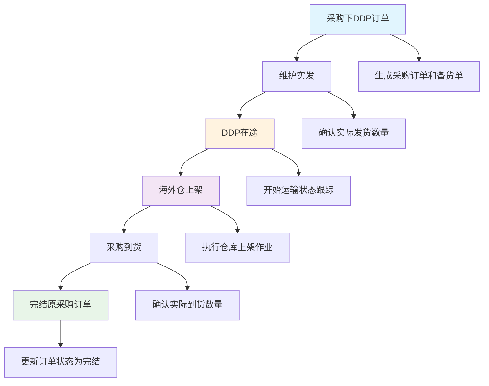
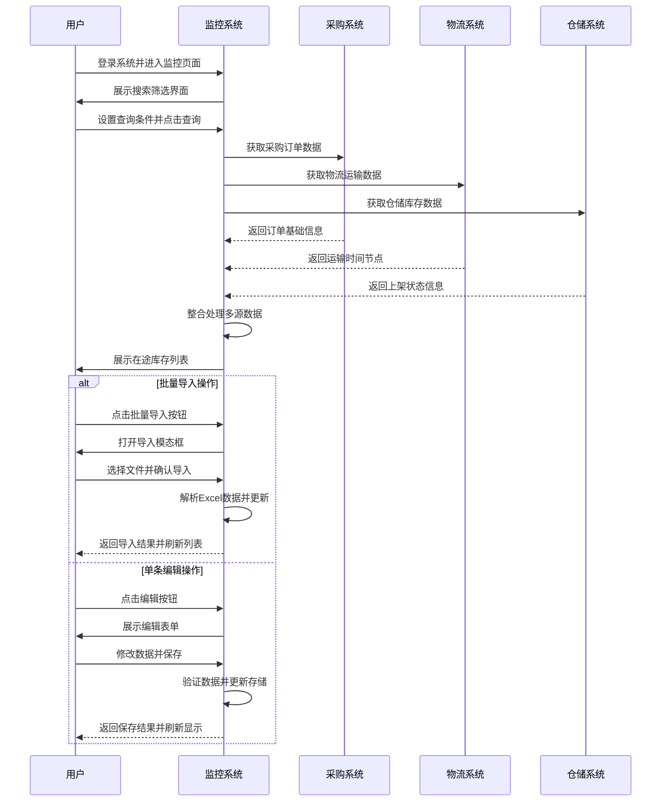
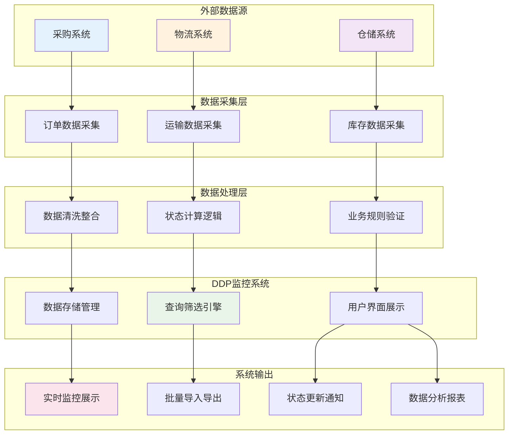
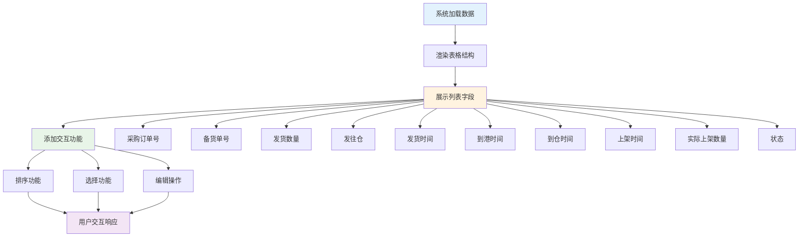
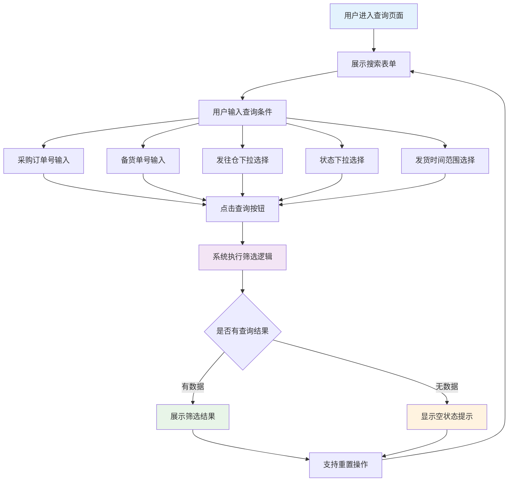
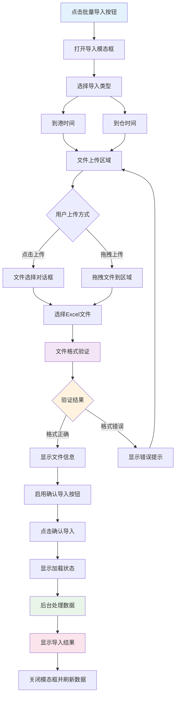

| 修订目录 | | | |
| --- | --- | --- | --- |
| 修订时间 | 修订版本 | 修订人 | 修订说明 |
| 2024.09.17 | V1.0 | 产品团队 | 新增版本V1.0 |

## **一、背景**

随着跨境电商DDP业务模式的快速发展，企业面临在途库存管理复杂化的挑战。传统的库存管理系统无法有效跟踪从"采购下DDP订单→维护实发→DDP在途→海外仓上架→采购到货→完结原采购订单"的完整业务流程。

当前业务痛点包括：信息孤岛导致各环节数据无法统一查看、手工录入时间节点效率低下易出错、缺乏实时状态监控和预警机制、无法支撑业务决策的数据分析能力。

因此，亟需建设一套完整的DDP在途库存监控系统，实现全流程可视化管理，提升运营效率，为业务决策提供数据支撑。

## **二、业务名词**

| 业务名词 | 名词说明 |
| :--- | :--- |
| DDP | Delivered Duty Paid，完税后交货模式，卖方承担所有运输费用和风险 |
| 采购订单号 | 企业采购系统生成的订单唯一标识码 |
| 备货单号 | 仓储管理系统生成的备货作业指导单据编号 |
| 发往仓 | 货物的目标配送仓库，如美国加州仓、德国柏林仓等 |
| 在途中 | 货物已发出但尚未完成海外仓上架的状态 |
| 已上架 | 货物已到达海外仓并完成入库上架操作的状态 |
| 已取消 | 采购订单被取消，货物停止配送的状态 |
| 到港时间 | 货物运输到达目的港口的具体时间节点 |
| 到仓时间 | 货物从港口运输到海外仓库的时间节点 |
| 上架时间 | 货物在海外仓完成入库检验并上架的时间节点 |

## **三、流程图**

### **1、业务流程图**

### **2、系统流程图**

### **3、数据流程图**

## **四、功能需求清单**

| 功能模块 | 功能目的 | 模块功能点 | 优先级 |
| :--- | :--- | :--- | :--- |
| 在途库存列表管理 | 提供完整的在途库存信息展示和管理功能，解决信息分散和查看不便的问题 | 列表字段展示 数据排序功能 分页浏览 状态标签显示 选择操作功能 | P0 |
| 搜索筛选功能 | 提供多维度查询筛选能力，解决大数据量中快速定位目标数据的问题 | 采购订单号搜索 备货单号搜索 发往仓筛选 状态筛选 发货时间范围筛选 重置查询条件 | P0 |
| 批量导入日期功能 | 提供高效的批量数据录入能力，解决手工录入效率低下和易出错的问题 | 到港时间批量导入 到仓时间批量导入 Excel文件上传 数据格式验证 导入模板下载 | P1 |
| 数据编辑功能 | 提供灵活的单条记录修改能力，解决数据维护和状态更新的问题 | 单条记录编辑 时间节点修改 实际上架数量更新 状态变更 数据验证保存 | P1 |
| 数据导出功能 | 提供数据导出和分析支持能力，解决外部系统集成和业务分析的需求 | CSV格式导出 筛选结果导出 文件下载功能 | P2 |

## **五、功能性需求说明**

### 在途库存列表管理

#### （1）功能流程

#### （2）交互说明

针对在途库存列表管理功能的交互细节进行补充说明：

- 表格支持按列排序，点击表头实现升序/降序切换，数值和日期类型字段优先支持排序
- 每行提供复选框选择功能，支持单选、多选和全选操作，选中状态影响批量操作按钮的可用性
- 状态字段使用不同颜色的标签进行可视化区分：在途中（橙色）、已上架（绿色）、已取消（红色）
- 每行末尾提供编辑操作按钮，点击后弹出编辑模态框进行单条记录修改
- 表格底部提供分页器，支持页码切换和每页显示数量调整，默认每页显示10条记录
- 时间字段为空时显示"-"，数量字段为0时显示实际数值，确保数据展示的准确性

#### （3）字段说明

| 字段名称 | 类型 | 字段要求 | 取值范围/枚举值 | 是否必填 | 默认值 | 业务含义 | 备注 |
| --- | --- | --- | --- | --- | --- | --- | --- |
| 选择框 | 布尔 | 支持用户选择 | true/false | - | false | 行选择状态标识 | 支持批量操作 |
| 采购订单号 | 文本 | 只读显示 | 字符串格式 | 是 | - | 采购系统生成的订单编号 | 支持排序和搜索 |
| 备货单号 | 文本 | 只读显示 | 字符串格式 | 是 | - | 仓储系统生成的备货单编号 | 支持排序和搜索 |
| 发货数量 | 数值 | 只读显示 | 正整数 | 是 | - | 实际发出的货物数量 | 支持排序 |
| 发往仓 | 文本 | 只读显示 | 仓库中文名称 | 是 | - | 目标海外仓库名称 | 显示友好名称 |
| 发货时间 | 日期 | 只读显示 | YYYY-MM-DD格式 | 是 | - | 货物实际发出时间 | 支持排序和筛选 |
| 到港时间 | 日期 | 可为空显示 | YYYY-MM-DD格式 | 否 | - | 货物到达港口时间 | 支持排序，空值显示"-" |
| 到仓时间 | 日期 | 可为空显示 | YYYY-MM-DD格式 | 否 | - | 货物到达仓库时间 | 支持排序，空值显示"-" |
| 上架时间 | 日期 | 可为空显示 | YYYY-MM-DD格式 | 否 | - | 货物完成上架时间 | 支持排序，空值显示"-" |
| 实际上架数量 | 数值 | 可为空显示 | 非负整数 | 否 | 0 | 实际入库上架数量 | 支持排序，0值正常显示 |
| 状态 | 枚举 | 彩色标签显示 | 在途中/已上架/已取消 | 是 | 在途中 | 货物当前处理状态 | 不同颜色区分状态 |
| 操作 | 按钮 | 固定显示 | 编辑按钮 | - | - | 提供编辑功能入口 | 点击打开编辑模态框 |

### 搜索筛选功能

#### （1）功能流程

#### （2）交互说明

针对搜索筛选功能的相关交互细节进行补充说明：

- 采购订单号和备货单号支持模糊匹配搜索，用户输入部分关键字即可查询相关记录
- 发往仓提供下拉选择框，包含所有可选仓库选项以及"全部"选项，避免用户输入错误
- 状态筛选提供下拉选择框，包含"在途中"、"已上架"、"已取消"以及"全部"选项
- 发货时间支持日期范围选择，提供开始时间和结束时间两个日期选择器
- 查询条件支持单独使用或任意组合使用，提供灵活的查询方式
- 查询结果实时更新表格内容，同时更新总记录数和分页信息
- 重置按钮一键清空所有查询条件，快速恢复到默认显示状态

#### （3）字段说明

| 字段名称 | 类型 | 字段要求 | 取值范围/枚举值 | 是否必填 | 默认值 | 业务含义 | 备注 |
| --- | --- | --- | --- | --- | --- | --- | --- |
| 采购订单号 | 文本 | 支持模糊匹配 | 字符串，部分匹配 | 否 | 空 | 按采购订单号筛选 | 忽略大小写 |
| 备货单号 | 文本 | 支持模糊匹配 | 字符串，部分匹配 | 否 | 空 | 按备货单号筛选 | 忽略大小写 |
| 发往仓 | 枚举 | 下拉选择 | US-CA/US-TX/UK-LON/DE-BER/全部 | 否 | 全部 | 按目标仓库筛选 | 显示中文名称 |
| 状态 | 枚举 | 下拉选择 | 在途中/已上架/已取消/全部 | 否 | 全部 | 按处理状态筛选 | 精确匹配 |
| 发货开始时间 | 日期 | 日期选择器 | YYYY-MM-DD格式 | 否 | 空 | 时间范围筛选起点 | 包含当天 |
| 发货结束时间 | 日期 | 日期选择器 | YYYY-MM-DD格式 | 否 | 空 | 时间范围筛选终点 | 包含当天 |

### 批量导入日期功能

#### （1）功能流程

#### （2）交互说明

针对批量导入日期功能的相关交互细节进行补充说明：

- 导入类型通过单选按钮选择，支持"到港时间"和"到仓时间"两种类型，默认选择"到港时间"
- 文件上传支持点击上传和拖拽上传两种方式，提供直观的上传区域视觉提示
- 文件格式严格验证，仅支持.xlsx和.xls格式的Excel文件，其他格式显示错误提示
- 提供导入模板下载链接，用户可下载标准格式模板确保数据格式正确
- 文件选择后显示文件名和文件大小信息，同时启用"确认导入"按钮
- 导入过程显示加载动画和进度提示，处理完成后显示导入成功或失败的详细结果
- 导入完成后自动关闭模态框并刷新表格数据，确保用户看到最新的数据状态

#### （3）字段说明

| 字段名称 | 类型 | 字段要求 | 取值范围/枚举值 | 是否必填 | 默认值 | 业务含义 | 备注 |
| --- | --- | --- | --- | --- | --- | --- | --- |
| 导入类型 | 枚举 | 单选按钮选择 | 到港时间/到仓时间 | 是 | 到港时间 | 指定要导入的时间数据类型 | 影响数据处理逻辑 |
| 上传文件 | 文件 | 文件格式验证 | .xlsx/.xls格式 | 是 | - | 包含时间数据的Excel文件 | 文件大小限制10MB |
| 文件名 | 文本 | 自动显示 | 上传文件的原始名称 | - | - | 用户确认上传文件信息 | 只读显示 |
| 文件大小 | 数值 | 自动计算 | 文件字节数转换 | - | - | 显示文件大小信息 | 以KB/MB为单位显示 |

## **六、非功能性需求说明**

### 1. 性能需求
- **页面响应时间**：首页加载不超过3秒，数据查询响应不超过2秒
- **并发处理能力**：支持30个用户同时在线操作，响应时间无明显增加
- **数据处理能力**：单次查询支持最大5000条记录展示，导出支持最大10000条记录
- **文件处理能力**：Excel导入文件大小限制10MB，支持最大1000行数据导入

### 2. 可用性需求
- **系统可用性**：系统整体可用性要求达到99%以上
- **故障恢复时间**：系统故障后恢复时间不超过2小时
- **操作简易性**：新用户经过简单培训后能够使用系统基本功能

### 3. 安全性需求
- **数据传输安全**：前后端数据传输采用HTTPS加密
- **操作权限控制**：不同用户角色具有不同的操作权限
- **数据备份机制**：重要数据变更操作记录操作日志

### 4. 兼容性需求
- **浏览器兼容**：支持Chrome 60+、Firefox 55+、Safari 12+、Edge 79+
- **移动端适配**：支持平板和手机浏览器访问，提供响应式界面
- **分辨率支持**：最低支持1024x768分辨率，推荐1920x1080分辨率

### 5. 扩展性需求
- **数据规模扩展**：系统设计支持数据量从万级扩展到十万级
- **功能模块扩展**：采用模块化设计，支持新功能模块的添加
- **接口扩展能力**：预留与其他业务系统集成的接口能力

### 6. 异常场景处理需求
- **网络异常处理**：网络超时或连接失败时显示友好提示并支持重试
- **文件上传异常**：文件格式错误、文件损坏等情况提供具体错误说明
- **数据冲突处理**：多用户同时编辑时采用最后提交优先的策略
- **系统异常恢复**：系统故障时保护用户数据完整性，支持事务回滚
