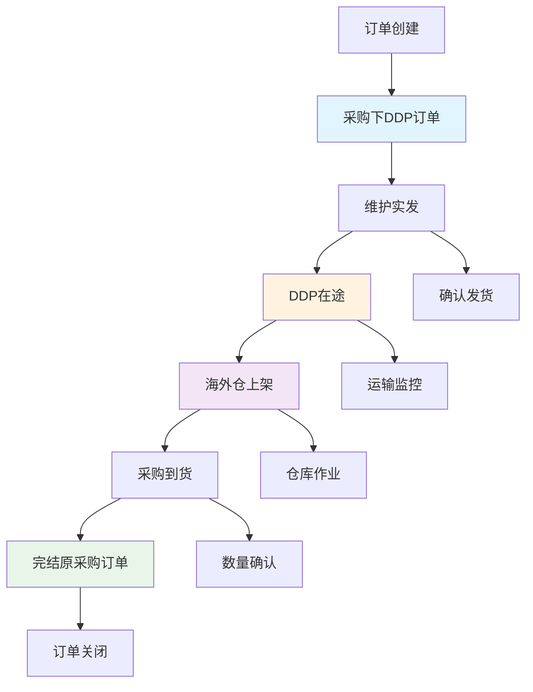
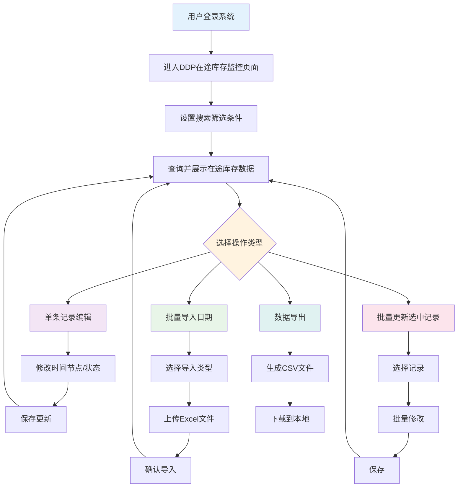
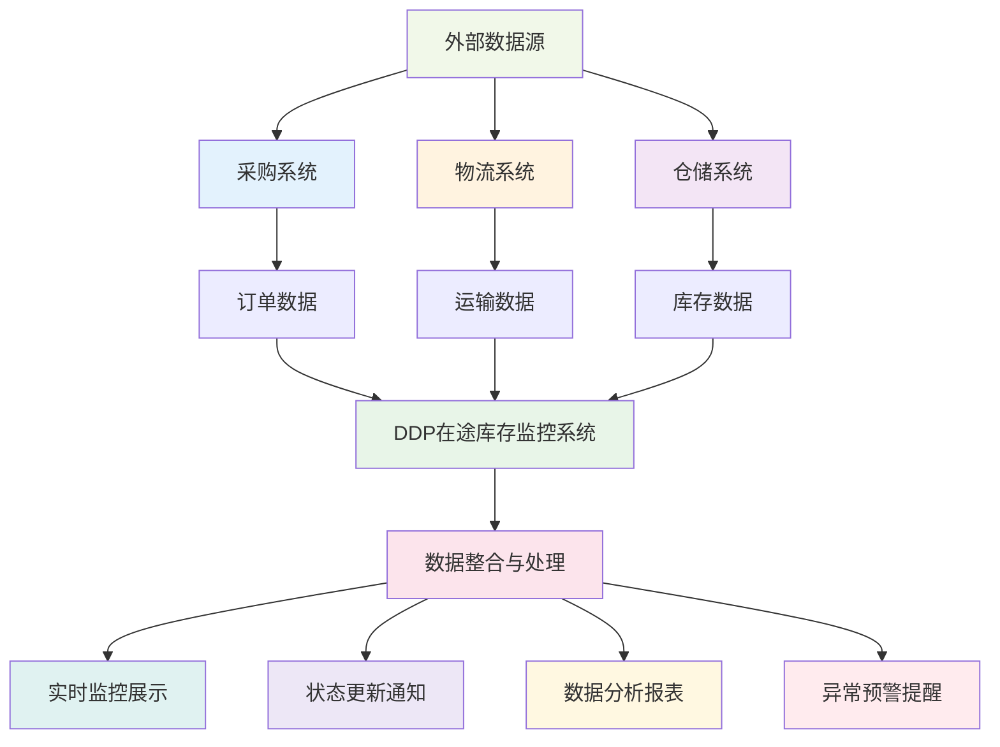
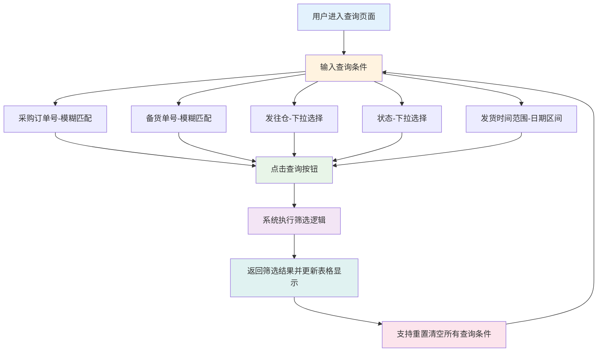
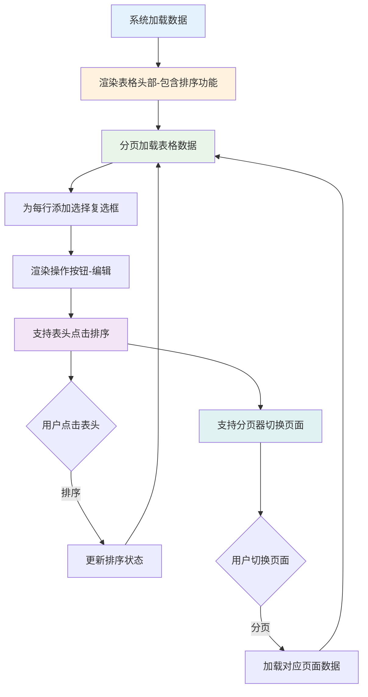
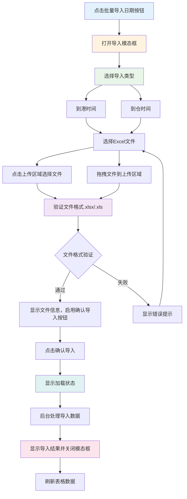
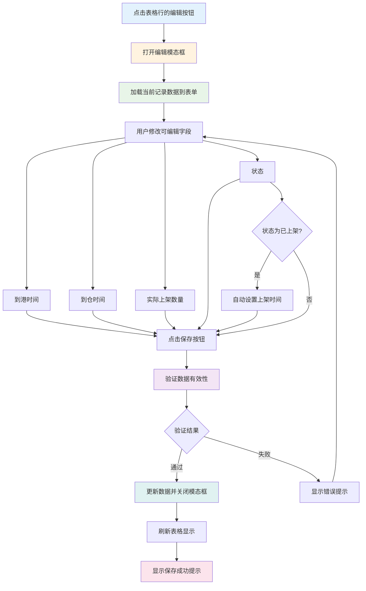
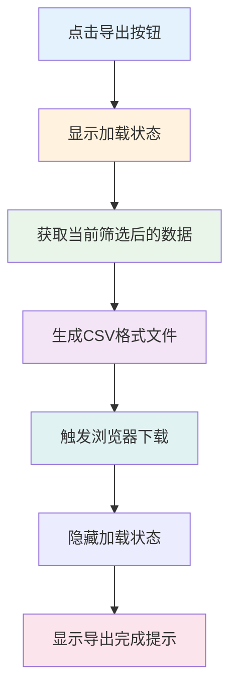

# DDP在途库存监控系统需求文档

| 修订目录 | | | |
| --- | --- | --- | --- |
| 修订时间 | 修订版本 | 修订人 | 修订说明 |
| 2024.09.17 | V1.0 | AI助手 | 新增版本V1.0 |

## **一、背景**

随着跨境电商业务的快速发展，DDP（Delivered Duty Paid）模式下的采购订单量持续增长。企业需要对从采购下单到海外仓上架的全流程进行精确监控，特别是在途库存状态的实时跟踪。

当前业务痛点：
1. 缺乏统一的在途库存监控平台，无法实时掌握货物状态
2. 各时间节点信息分散，影响决策效率
3. 批量数据导入效率低，人工处理易出错
4. 缺乏系统性的数据导出和分析功能

因此，需要建设一套完整的DDP在途库存监控系统，实现从采购订单到海外仓上架的全流程可视化管理，提升库存管理效率和决策支持能力。

## **二、业务名词**

| 业务名词 | 名词说明 |
| :--- | :--- |
| DDP | Delivered Duty Paid，完税后交货，卖方需承担将货物运送到买方指定地点的一切费用和风险 |
| 采购订单号 | 企业内部采购系统生成的唯一订单标识 |
| 备货单号 | 仓储管理系统生成的备货作业单据编号 |
| 发往仓 | 货物的目标海外仓库，如美国加州仓、德国柏林仓等 |
| 在途中 | 货物已发出但尚未完成最终上架的状态 |
| 已上架 | 货物已到达海外仓并完成入库上架操作 |
| 已取消 | 采购订单被取消，货物不再继续配送 |
| 到港时间 | 货物到达目的港口的时间 |
| 到仓时间 | 货物到达海外仓库的时间 |
| 上架时间 | 货物完成仓库入库上架的时间 |

## **三、流程图**

### **1. 业务流程图**

### **2. 系统流程图**

### **3. 数据流程图**

## **四、功能需求清单**

| 模块 | 需求点 | 目标 | 优先级 |
| :--- | :--- | :--- | :--- |
| 数据查询模块 | 多条件搜索筛选 | 提供采购订单号、备货单号、发往仓、状态、时间范围等多维度查询，提升数据检索效率 | P0 |
| 数据展示模块 | 在途库存列表展示 | 完整展示所有关键字段信息，支持排序和分页，提供清晰的数据视图 | P0 |
| 数据编辑模块 | 单条记录编辑 | 支持修改时间节点、实际数量、状态等关键信息，确保数据准确性 | P0 |
| 批量操作模块 | 批量导入日期 | 支持Excel文件批量导入到港时间和到仓时间，提升数据录入效率 | P1 |
| 批量操作模块 | 批量更新记录 | 支持选中多条记录进行批量状态更新，提升操作效率 | P1 |
| 数据导出模块 | CSV格式导出 | 支持将筛选后的数据导出为CSV格式，便于外部分析和备份 | P1 |
| 系统界面模块 | 响应式设计 | 支持PC端和移动端访问，适配不同屏幕尺寸，提升用户体验 | P2 |
| 操作反馈模块 | 加载状态提示 | 提供操作进度反馈和结果提示，增强用户操作体验 | P2 |

## **五、功能性需求说明**

### 功能一：数据查询与筛选

#### （1）功能流程

#### （2）交互说明
- 搜索框支持实时输入，无需等待
- 下拉选择提供预设选项，避免输入错误
- 日期选择器提供日历界面，支持快速选择
- 查询按钮执行筛选，重置按钮清空所有条件
- 查询结果实时更新表格内容和统计信息

#### （3）字段说明

| 字段名称 | 类型 | 取值范围/枚举值 | 是否必填 | 默认值 | 业务含义 | 备注 |
| --- | --- | --- | --- | --- | --- | --- |
| 采购订单号 | 文本 | 字符串，支持模糊匹配 | 否 | 空 | 采购系统生成的订单编号 | 支持部分匹配搜索 |
| 备货单号 | 文本 | 字符串，支持模糊匹配 | 否 | 空 | 仓储系统生成的备货单编号 | 支持部分匹配搜索 |
| 发往仓 | 枚举 | US-CA,US-TX,UK-LON,DE-BER | 否 | 全部 | 目标海外仓库标识 | 下拉选择，含"全部"选项 |
| 状态 | 枚举 | 在途中,已上架,已取消 | 否 | 全部 | 当前货物状态 | 下拉选择，含"全部"选项 |
| 发货开始时间 | 日期 | YYYY-MM-DD格式 | 否 | 空 | 查询时间范围起始日期 | 日期选择器 |
| 发货结束时间 | 日期 | YYYY-MM-DD格式 | 否 | 空 | 查询时间范围结束日期 | 日期选择器 |

### 功能二：在途库存数据展示

#### （1）功能流程

#### （2）交互说明
- 表格支持按列排序，点击表头切换升序/降序
- 支持全选和单选复选框操作
- 每行提供编辑操作按钮
- 分页器支持页码跳转和每页条数设置
- 状态字段使用不同颜色标签区分

#### （3）字段说明

| 字段名称 | 类型 | 取值范围/枚举值 | 是否必填 | 默认值 | 业务含义 | 备注 |
| --- | --- | --- | --- | --- | --- | --- |
| 采购订单号 | 文本 | 字符串 | 是 | 无 | 采购系统订单编号 | 只读显示 |
| 备货单号 | 文本 | 字符串 | 是 | 无 | 仓储系统备货单编号 | 只读显示 |
| 发货数量 | 数值 | 正整数 | 是 | 无 | 实际发出的货物数量 | 只读显示，支持排序 |
| 发往仓 | 文本 | 仓库名称 | 是 | 无 | 目标仓库中文名称 | 只读显示 |
| 发货时间 | 日期 | YYYY-MM-DD | 是 | 无 | 货物发出时间 | 只读显示，支持排序 |
| 到港时间 | 日期 | YYYY-MM-DD | 否 | 空 | 货物到达港口时间 | 支持排序，可为空显示"-" |
| 到仓时间 | 日期 | YYYY-MM-DD | 否 | 空 | 货物到达仓库时间 | 支持排序，可为空显示"-" |
| 上架时间 | 日期 | YYYY-MM-DD | 否 | 空 | 货物完成上架时间 | 支持排序，可为空显示"-" |
| 实际上架数量 | 数值 | 正整数 | 否 | 0 | 实际入库上架数量 | 支持排序，可为空显示"-" |
| 状态 | 枚举 | 在途中,已上架,已取消 | 是 | 在途中 | 当前货物状态 | 彩色标签显示 |

### 功能三：批量导入日期

#### （1）功能流程

#### （2）交互说明
- 支持点击上传和拖拽上传两种方式
- 文件格式验证，仅支持Excel格式
- 提供导入模板下载功能
- 导入过程显示加载动画
- 导入完成后显示结果提示

#### （3）字段说明

| 字段名称 | 类型 | 取值范围/枚举值 | 是否必填 | 默认值 | 业务含义 | 备注 |
| --- | --- | --- | --- | --- | --- | --- |
| 导入类型 | 枚举 | 到港时间,到仓时间 | 是 | 到港时间 | 指定要导入的时间类型 | 单选按钮选择 |
| 上传文件 | 文件 | .xlsx,.xls格式 | 是 | 无 | 包含时间数据的Excel文件 | 支持拖拽和点击上传 |

### 功能四：数据编辑

#### （1）功能流程

#### （2）交互说明
- 采购订单号和备货单号为只读字段
- 日期字段提供日期选择器
- 状态变更为"已上架"时自动设置上架时间
- 表单验证确保数据完整性
- 保存成功后自动关闭模态框

#### （3）字段说明

| 字段名称 | 类型 | 取值范围/枚举值 | 是否必填 | 默认值 | 业务含义 | 备注 |
| --- | --- | --- | --- | --- | --- | --- |
| 采购订单号 | 文本 | 字符串 | 是 | 原值 | 采购系统订单编号 | 只读字段 |
| 备货单号 | 文本 | 字符串 | 是 | 原值 | 仓储系统备货单编号 | 只读字段 |
| 到港时间 | 日期 | YYYY-MM-DD | 否 | 原值 | 货物到达港口时间 | 可编辑，日期选择器 |
| 到仓时间 | 日期 | YYYY-MM-DD | 否 | 原值 | 货物到达仓库时间 | 可编辑，日期选择器 |
| 实际上架数量 | 数值 | 正整数 | 否 | 原值 | 实际入库上架数量 | 可编辑，数字输入框 |
| 状态 | 枚举 | 在途中,已上架,已取消 | 是 | 原值 | 当前货物状态 | 可编辑，下拉选择 |

### 功能五：数据导出

#### （1）功能流程

#### （2）交互说明
- 导出当前筛选条件下的所有数据
- 导出过程显示加载动画
- 自动生成文件名（包含时间戳）
- 导出完成后显示成功提示

#### （3）字段说明

| 字段名称 | 类型 | 取值范围/枚举值 | 是否必填 | 默认值 | 业务含义 | 备注 |
| --- | --- | --- | --- | --- | --- | --- |
| 导出格式 | 枚举 | CSV | 是 | CSV | 导出文件格式 | 当前仅支持CSV |
| 文件名 | 文本 | ddp_inventory_YYYYMMDD.csv | 是 | 自动生成 | 导出文件名称 | 包含日期时间戳 |

## **六、非功能性需求说明**

### 1. 性能需求
- 页面加载时间：首次加载不超过3秒
- 数据查询响应时间：不超过2秒
- 支持并发用户数：50人同时在线
- 单次数据导出：支持最大10000条记录

### 2. 可用性需求
- 系统可用性：99.5%以上
- 7x24小时稳定运行
- 支持主流浏览器：Chrome 60+、Firefox 55+、Safari 12+、Edge 79+

### 3. 安全性需求
- 用户身份认证和授权
- 数据传输加密（HTTPS）
- 操作日志记录和审计
- 敏感数据脱敏处理

### 4. 兼容性需求
- 响应式设计，支持PC端和移动端
- 屏幕分辨率：1024x768及以上
- 移动端适配：iOS 12+、Android 8+

### 5. 扩展性需求
- 模块化设计，支持功能扩展
- 支持与外部系统API集成
- 数据库设计支持大数据量扩展
- 支持微服务架构部署

### 6. 维护性需求
- 完整的技术文档和用户手册
- 标准化的代码规范和注释
- 自动化测试覆盖率80%以上
- 支持一键部署和回滚
