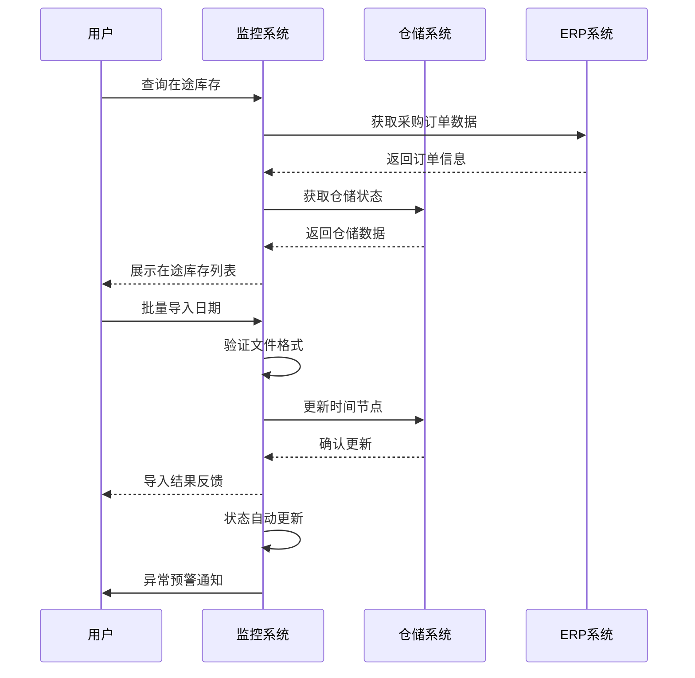
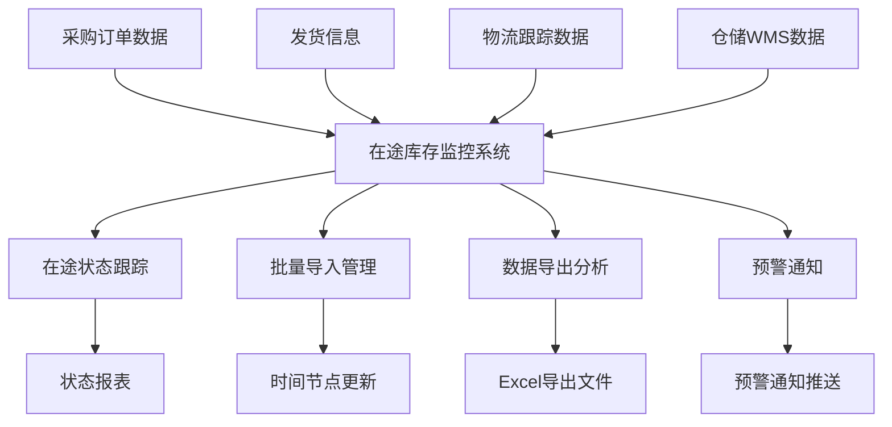

# DDP在途库存监控系统需求文档

| 修订目录 | | | |
| --- | --- | --- | --- |
| 修订时间 | 修订版本 | 修订人 | 修订说明 |
| 2025.09.16 | V1.0 | 系统分析师 | 新增版本V1.0 |

## 一、背景

随着DDP（Delivered Duty Paid）业务模式的广泛应用，企业在跨境电商和国际贸易中面临着复杂的库存管理挑战。从采购订单下达到最终货物上架完成，整个流程涉及多个关键环节：采购下DDP订单、维护实发、DDP在途、海外仓上架、采购到货、完结原采购订单。

为了提高库存管理的透明度和效率，减少库存积压和缺货风险，及时掌握货物在途状态，需要建立一套完整的DDP在途库存监控系统。该系统将实现对整个供应链流程的实时监控，提供准确的库存状态信息，支持批量操作和数据分析，从而提升企业的运营效率和客户满意度。

## 二、业务名词

| 业务名词 | 名词说明 |
| :--- | :--- |
| DDP | Delivered Duty Paid，完税后交货，卖方承担货物运至指定目的地的一切费用和风险 |
| 采购在途 | 采购订单已下达，货物尚未到达海外仓的状态 |
| 海运在途 | 货物正在海运运输过程中的状态 |
| 在库库存 | 货物已到达海外仓并完成上架的库存状态 |
| 备货单号 | 用于标识备货批次的唯一编号 |
| 发往仓 | 货物的目标海外仓库 |
| 到港时间 | 货物到达目的港口的时间 |
| 到仓时间 | 货物到达海外仓的时间 |
| 上架时间 | 货物在海外仓完成上架操作的时间 |
| 实际上架数量 | 货物实际完成上架的商品数量 |

## 三、流程图

### 1、业务流程图


### 2、系统流程图



### 3、数据流程图



## 四、需求清单

### 1、需求目标及优先级

| 功能名称 | 目标 | 优先级 |
| :--- | :--- | :--- |
| 在途库存管理列表 | 提供DDP在途库存的统一管理视图，实时监控货物状态，支持搜索筛选和排序 | P0 |
| 批量导入日期功能 | 支持批量更新到港时间、到仓时间，提高操作效率，减少人工录入错误 | P1 |
| 状态跟踪管理 | 实现在途中、已上架、已取消状态的自动化管理和流转 | P0 |
| 数据编辑管理 | 提供单条记录编辑功能，支持关键字段的实时更新 | P1 |
| 数据导出功能 | 提供筛选数据的CSV导出，支持数据分析和报表制作 | P1 |
| 响应式界面设计 | 支持PC端和移动端访问，提供良好的用户体验 | P2 |

### 2、功能结构

```
DDP在途库存监控系统
├── 在途库存管理列表
│   ├── 数据展示
│   ├── 搜索筛选
│   ├── 排序分页
│   └── 批量选择
├── 批量导入日期
│   ├── 到港时间导入
│   ├── 到仓时间导入
│   ├── 文件上传
│   └── 模板下载
├── 数据编辑管理
│   ├── 单行编辑
│   ├── 状态更新
│   └── 字段验证
└── 数据导出
    ├── 筛选导出
    ├── CSV格式
    └── 进度提示
```

## 五、功能性需求说明

### 功能一：在途库存管理列表

#### （1）功能流程
1. 系统加载时自动获取所有DDP在途库存数据
2. 用户可通过搜索条件筛选数据
3. 支持按字段排序和分页显示
4. 提供批量选择和操作功能
5. 实时更新数据状态和计数信息

#### （2）交互说明
- 页面头部提供搜索筛选区域，支持多条件组合查询
- 表格支持列排序，点击表头切换升序/降序
- 支持行选择，包括单选、多选和全选功能
- 分页器支持页码跳转和每页显示数量设置
- 状态字段以不同颜色标签显示，增强视觉识别

#### （3）字段说明

| 字段名称 | 字段要求 | 备注说明 |
| --- | --- | --- |
| 采购订单号 | 字段类型：文本输入框<br/>支持模糊搜索 | 采购订单的唯一标识号，必填字段 |
| 备货单号 | 字段类型：文本输入框<br/>支持模糊搜索 | 备货单的唯一标识号，必填字段 |
| 发货数量 | 字段类型：数字显示<br/>支持排序 | 实际发货的商品数量 |
| 发往仓 | 字段类型：下拉选择框<br/>枚举值：美国加州仓、美国德州仓、英国伦敦仓、德国柏林仓 | 目标海外仓库名称 |
| 发货时间 | 字段类型：日期范围选择<br/>格式：YYYY-MM-DD | 货物实际发货的时间 |
| 到港时间 | 字段类型：日期显示<br/>支持批量导入 | 货物到达目的港口的时间 |
| 到仓时间 | 字段类型：日期显示<br/>支持批量导入 | 货物到达海外仓的时间 |
| 上架时间 | 字段类型：日期显示<br/>系统自动记录 | 货物完成上架操作的时间 |
| 实际上架数量 | 字段类型：数字显示<br/>支持排序 | 实际完成上架的商品数量 |
| 状态 | 字段类型：状态标签<br/>枚举值：在途中、已上架、已取消 | 当前货物的流转状态 |

### 功能二：批量导入日期功能

#### （1）功能流程
1. 用户点击"批量导入日期"按钮打开导入弹窗
2. 选择导入类型（到港时间或到仓时间）
3. 上传Excel文件或拖拽文件到指定区域
4. 系统验证文件格式和内容
5. 确认导入后批量更新对应时间字段
6. 返回导入结果和成功条数

#### （2）交互说明
- 提供模态弹窗形式的导入界面
- 支持单选按钮选择导入类型
- 文件上传区域支持点击上传和拖拽上传
- 提供导入模板下载功能
- 导入过程显示加载状态和进度提示
- 导入完成后显示成功/失败结果统计

#### （3）字段说明

| 字段名称 | 字段要求 | 备注说明 |
| --- | --- | --- |
| 导入类型 | 字段类型：单选按钮<br/>枚举值：到港时间、到仓时间 | 选择要批量更新的时间类型 |
| 文件上传 | 字段类型：文件选择器<br/>格式限制：.xlsx, .xls | 支持Excel文件格式的批量导入 |

### 功能三：数据编辑管理

#### （1）功能流程
1. 用户点击表格行的"编辑"按钮
2. 弹出编辑表单，预填当前记录数据
3. 用户修改可编辑字段
4. 系统验证输入数据的合法性
5. 保存更新后刷新表格显示
6. 如状态变为"已上架"，自动记录上架时间

#### （2）交互说明
- 编辑表单以模态弹窗形式展示
- 采购订单号和备货单号为只读字段
- 支持修改到港时间、到仓时间、实际上架数量和状态
- 提供表单验证和错误提示
- 状态联动更新相关时间字段

#### （3）字段说明

| 字段名称 | 字段要求 | 备注说明 |
| --- | --- | --- |
| 到港时间 | 字段类型：日期选择器<br/>格式：YYYY-MM-DD | 可手动编辑的到港时间 |
| 到仓时间 | 字段类型：日期选择器<br/>格式：YYYY-MM-DD | 可手动编辑的到仓时间 |
| 实际上架数量 | 字段类型：数字输入框<br/>验证：正整数 | 实际完成上架的商品数量 |
| 状态 | 字段类型：下拉选择框<br/>枚举值：在途中、已上架、已取消 | 当前货物的流转状态 |

### 功能四：数据导出功能

#### （1）功能流程
1. 用户点击"导出"按钮
2. 系统获取当前筛选条件下的所有数据
3. 生成CSV格式的导出文件
4. 显示导出进度和加载状态
5. 自动下载生成的文件到本地
6. 提示导出完成和文件信息

#### （2）交互说明
- 导出按钮位于表格工具栏右侧
- 导出过程显示加载遮罩和进度提示
- 导出文件名包含当前日期时间戳
- 支持大数据量的分批导出处理

#### （3）字段说明

| 字段名称 | 字段要求 | 备注说明 |
| --- | --- | --- |
| 导出格式 | 字段类型：固定格式<br/>格式：CSV | 兼容Excel打开的CSV格式文件 |
| 导出范围 | 字段类型：当前筛选结果<br/>包含所有显示列 | 导出当前搜索筛选条件下的所有数据 |

## 六、非功能性需求说明

### 1、性能要求
- 页面初始加载时间不超过3秒
- 支持同时在线用户数不少于50人
- 单次批量导入支持不少于1000条记录
- 数据查询响应时间不超过2秒
- 大数据量表格采用分页加载优化

### 2、兼容性要求
- 支持Chrome 60+、Firefox 55+、Safari 12+、Edge 79+
- 不支持IE浏览器
- 支持PC端、平板和手机端访问
- 响应式设计适配不同屏幕尺寸

### 3、安全性要求
- 用户操作日志记录，可追溯所有数据变更
- 实现角色权限控制，不同用户具备不同操作权限
- 数据传输采用HTTPS加密
- 敏感数据字段进行脱敏处理
- 定期数据备份，确保数据安全

### 4、可用性要求
- 系统可用性达到99.5%以上
- 提供7x24小时监控和告警机制
- 关键操作提供确认提示和撤销功能
- 异常情况下提供友好的错误提示信息
- 支持数据导入导出的容灾恢复

### 5、扩展性要求
- 系统架构支持模块化扩展
- 数据库设计支持水平扩展
- 预留与ERP、WMS等外部系统的接口
- 支持多语言国际化扩展
- 预留移动端APP接口支持

### 6、维护性要求
- 代码结构清晰，注释完整
- 提供详细的系统操作手册
- 支持系统配置的在线修改
- 提供系统监控和性能分析工具
- 建立完善的测试用例和回归测试机制
