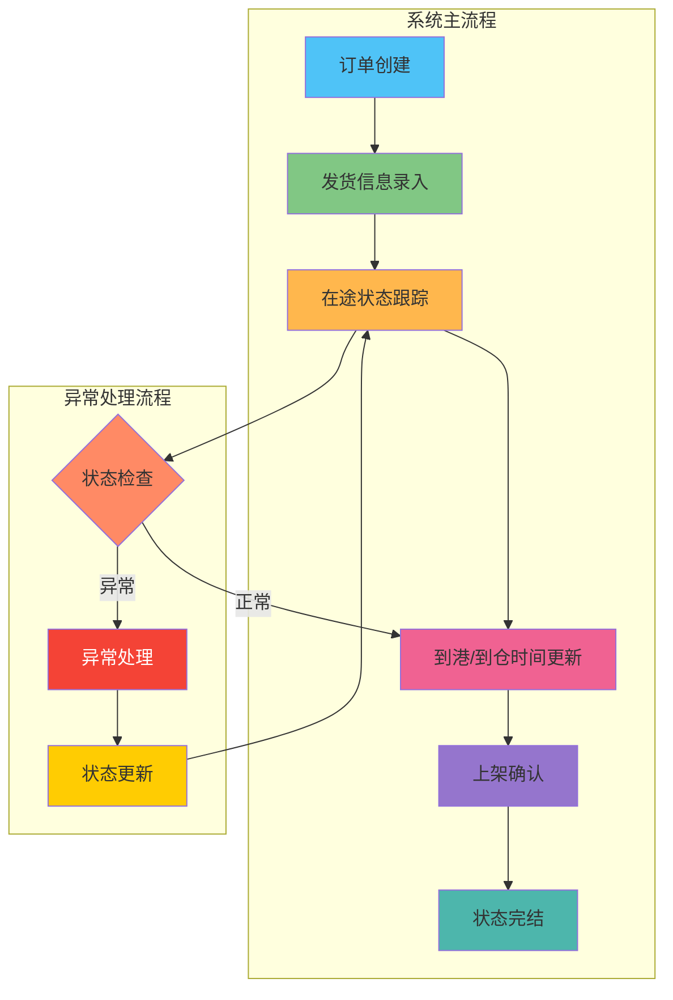

# DDP在途库存监控需求文档

| 修订目录 | | | |
| --- | --- | --- | --- |
| 修订时间 | 修订版本 | 修订人 | 修订说明 |
| 2025.09.13 | V1.0 | 陈鸿彬 | 新增版本V1.0 |

## **一、背景**
随着DDP（Delivered Duty Paid）业务模式的发展，采购订单从下单到最终完结涉及多个环节：采购下DDP订单、维护实发、DDP在途、海外仓上架、采购到货、完结原采购订单。为了更好地监控和管理在途库存状态，提高库存管理效率和准确性，需要建立一套完整的DDP在途库存监控系统。

## **二、业务名词**

| 业务名词 | 名词说明 |
| :--- | :--- |
| DDP | Delivered Duty Paid，完税后交货，卖方承担货物运至指定目的地的一切费用和风险 |
| 采购在途 | 采购订单已下达，货物尚未到达海外仓的状态 |
| 海运在途 | 货物正在海运运输过程中的状态 |
| 在库库存 | 货物已到达海外仓并完成上架的库存状态 |
| 备货单号 | 用于标识备货批次的唯一编号 |
| 到港时间 | 货物到达目的港口的时间 |
| 到仓时间 | 货物到达海外仓的时间 |
| 上架时间 | 货物在海外仓完成上架操作的时间 |

## **三、流程图**

### **1、业务流程图**

### **2、系统流程图**

## **四、功能清单**

| 功能名称 | 目标 | 优先级 |
| :--- | :--- | :--- |
| 在途库存管理列表 | 提供DDP在途库存的统一管理视图，实时监控货物状态 | P0 |
| 批量导入日期功能 | 支持批量更新到港时间、到仓时间，提高操作效率 | P1 |
| 状态跟踪管理 | 实现在途中、已上架、已取消状态的自动化管理 | P0 |
| 异常处理管理 | 识别和处理运输异常、数量差异等问题，建立异常处理工单流程 | P1 |
| 预警通知系统 | 提供多维度预警机制，支持多种通知方式，及时提醒相关人员 | P1 |
| 数据分析报表 | 提供库存分析、运输效率、异常统计等多维度报表功能 | P2 |
| 权限管理 | 实现细粒度的角色权限控制和审批流程管理 | P1 |
| 系统集成接口 | 与ERP、WMS、物流系统等外部系统的数据集成 | P0 |

## **五、功能性需求说明**

### **功能一：在途库存管理列表**

**（1）原型**
展示所有DDP在途库存信息的列表页面，支持查询、筛选、排序等操作。

**（2）交互说明**

- 用户可以通过采购订单号、备货单号等字段进行搜索
- 支持按状态、发货时间等字段进行筛选
- 支持列表字段的排序功能
- 提供批量操作功能（批量导入日期）

**（3）字段说明**

| 字段名称 | 字段说明 | 备注 |
| :--- | :--- | :--- |
| 采购订单号 | 采购订单的唯一标识号 | 必填，支持搜索 |
| 备货单号 | 备货单的唯一标识号 | 必填，支持搜索 |
| 发货数量 | 实际发货的商品数量 | 数字类型 |
| 发往仓 | 目标海外仓库名称 | 下拉选择 |
| 发货时间 | 货物实际发货的时间 | 日期时间类型 |
| 到港时间 | 货物到达目的港口的时间 | 日期时间类型，支持批量导入 |
| 到仓时间 | 货物到达海外仓的时间 | 日期时间类型，支持批量导入 |
| 上架时间 | 货物完成上架操作的时间 | 日期时间类型，系统自动记录 |
| 实际上架数量 | 实际完成上架的商品数量 | 数字类型 |
| 状态 | 当前货物的状态 | 枚举：在途中/已上架/已取消 |

### **功能二：批量导入日期功能**

**（1）原型**
提供批量导入界面，支持Excel文件上传或手动批量编辑。

**（2）交互说明**

- 支持Excel模板下载
- 支持批量选择记录进行日期更新
- 提供导入结果反馈和错误提示

**（3）字段说明**

| 字段名称 | 字段说明 | 备注 |
| :--- | :--- | :--- |
| 到港时间 | 批量更新货物到港时间 | 支持Excel导入 |
| 到仓时间 | 批量更新货物到仓时间 | 支持Excel导入 |

## **六、非功能性需求说明**

### **1、验收清单**

| 核心验收点 | 验收内容概述 |
| :--- | :--- |
| 在途库存列表展示 | 能够正确显示所有DDP在途库存信息，字段完整准确 |
| 搜索筛选功能 | 支持按采购订单号、备货单号等关键字段进行搜索和筛选 |
| 状态管理 | 状态流转正确，在途中→已上架→已取消的状态变更逻辑正确 |
| 批量导入功能 | 能够成功批量导入到港时间和到仓时间，并提供错误反馈 |
| 数据准确性 | 发货数量与实际上架数量的对比准确，异常情况能够及时提醒 |

### **2、上线注意事项**

| 角色 | 需准备事项 |
| :--- | :--- |
| IT | 1. 准备数据库表结构和索引优化 2. 配置定时任务同步采购和仓储数据 3. 准备Excel导入模板 4. 设置权限控制和操作日志 |
| 业务方 | 1. 准备历史DDP在途库存数据进行初始化 2. 制定操作规范和培训计划 3. 确认各海外仓的对接方式 4. 建立异常处理流程 |
| 采购部门 | 1. 确认采购订单数据字段映射关系 2. 制定发货信息维护标准 |
| 仓储部门 | 1. 确认上架数据回传机制 2. 制定到港、到仓时间录入标准 |

### **3、性能要求**
- 列表页面加载时间不超过3秒
- 支持同时在线用户数不少于50人
- 批量导入功能单次支持不少于1000条记录

### **4、安全要求**
- 操作日志记录，可追溯所有数据变更
- 角色权限控制，不同角色具备不同操作权限
- 数据备份机制，确保数据安全

