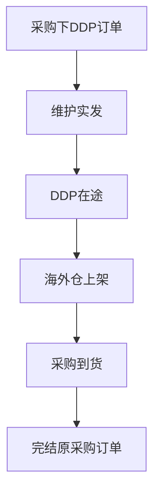
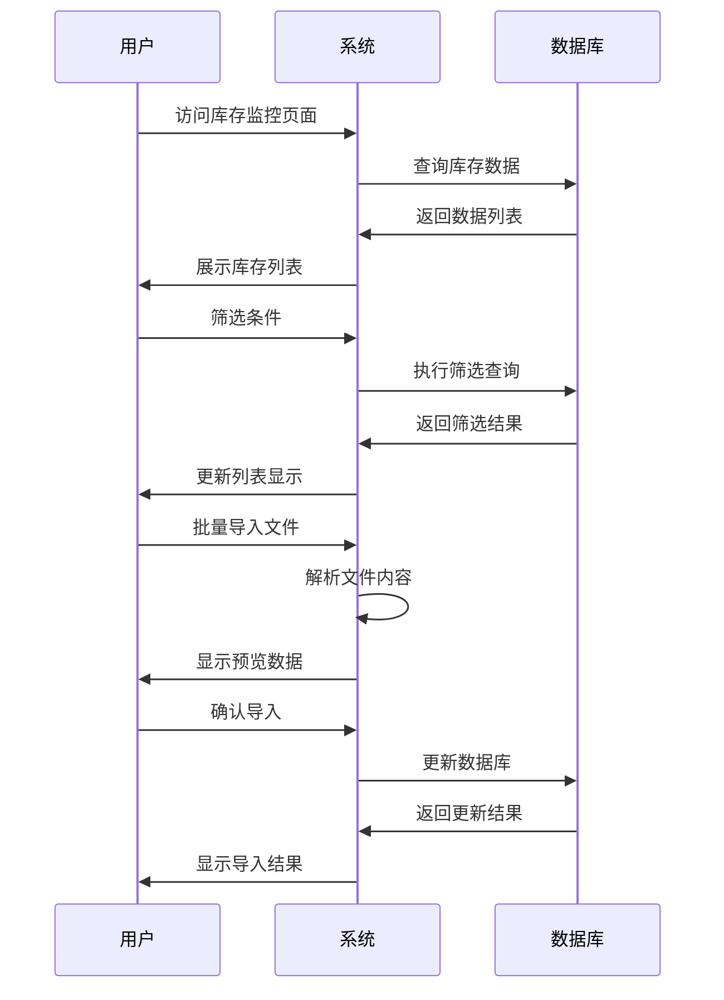

# DDP在途库存监控系统 - 前端交互原型

## 📋 项目概述

这是一个基于React + Ant Design的DDP在途库存监控系统前端交互原型，用于管理和监控DDP模式下的在途库存，跟踪从采购下单到海外仓上架的全流程状态。

## 🚀 快速开始

### 运行原型
1. 直接在浏览器中打开 `ddp-inventory-monitor.html` 文件
2. 无需安装任何依赖，所有资源通过CDN加载
3. 支持现代浏览器（Chrome、Firefox、Safari、Edge）

### 技术栈
- **前端框架**: React 18
- **UI组件库**: Ant Design 5.26.7
- **日期处理**: Day.js
- **构建方式**: 单文件HTML（包含CSS和JavaScript）

## 🎯 核心功能

### 1. 数据展示功能
- ✅ **库存列表展示**: 基于Ant Design Table组件的数据表格
- ✅ **状态标签**: 在途中、已上架、已取消三种状态的可视化展示
- ✅ **数据统计**: 总订单数、在途订单、已上架订单、上架完成率统计卡片
- ✅ **分页功能**: 支持分页、每页条数选择、快速跳转

### 2. 筛选和搜索功能
- ✅ **多条件筛选**: 采购订单号、备货单号、发往仓、状态筛选
- ✅ **日期范围筛选**: 发货时间范围选择
- ✅ **重置功能**: 一键清空所有筛选条件
- ✅ **实时搜索**: 支持模糊匹配和精确搜索

### 3. 批量操作功能
- ✅ **批量导入**: 支持Excel/CSV文件上传和数据预览
- ✅ **批量删除**: 支持多选删除功能
- ✅ **数据导出**: 导出当前筛选结果（功能占位）
- ✅ **数据刷新**: 手动刷新数据功能

### 4. 数据管理功能
- ✅ **行内编辑**: 支持单条记录的编辑操作
- ✅ **删除确认**: 删除操作的二次确认机制
- ✅ **状态管理**: 订单状态的可视化管理
- ✅ **详情查看**: 采购订单号点击查看详情（功能占位）

## 📊 数据字段说明

### 列表字段
| 字段名称 | 字段类型 | 组件类型 | 是否必填 | 说明 |
|---------|---------|---------|---------|------|
| 采购订单号 | 文本 | 链接按钮 | 是 | 唯一标识，可点击查看详情 |
| 备货单号 | 文本 | 文本显示 | 是 | 备货单据编号 |
| 发货数量 | 数值 | 数值显示 | 是 | 支持千分位格式化 |
| 发往仓 | 文本 | 文本显示 | 是 | 目标仓库名称 |
| 发货时间 | 日期 | 日期显示 | 是 | YYYY-MM-DD格式 |
| 到港时间 | 日期 | 日期显示 | 否 | 可批量导入更新 |
| 到仓时间 | 日期 | 日期显示 | 否 | 可批量导入更新 |
| 上架时间 | 日期 | 日期显示 | 否 | 可批量导入更新 |
| 实际上架数量 | 数值 | 数值显示 | 否 | 支持千分位格式化 |
| 状态 | 枚举 | 标签组件 | 是 | 在途中/已上架/已取消 |

### 状态枚举值
- **在途中**: 蓝色标签，表示货物正在运输途中
- **已上架**: 绿色标签，表示货物已成功上架
- **已取消**: 橙色标签，表示订单已取消

## 🎨 界面设计特性

### 1. 响应式布局
- 支持不同屏幕尺寸的自适应显示
- 表格支持横向滚动，确保在小屏幕上的可用性
- 筛选表单采用内联布局，节省垂直空间

### 2. 用户体验优化
- **加载状态**: 所有异步操作都有loading状态提示
- **操作反馈**: 成功/失败操作都有message提示
- **确认机制**: 危险操作（删除）有二次确认
- **数据预览**: 批量导入前可预览数据内容

### 3. 视觉设计
- 遵循Ant Design设计规范
- 统一的颜色体系和间距规范
- 清晰的信息层级和视觉焦点
- 友好的空状态和错误状态处理

## 🔧 交互流程

### 1. 业务流程图


### 2. 系统流程图


### 3. 数据流程图


## 📱 功能演示

### 1. 主界面功能
- 打开原型文件后，可以看到完整的库存监控界面
- 顶部显示统计卡片，展示关键业务指标
- 中间是筛选区域，支持多维度条件筛选
- 底部是数据表格，展示详细的库存信息

### 2. 交互操作演示
- **筛选功能**: 在筛选表单中输入条件，点击"查询"按钮
- **批量导入**: 点击"批量导入日期"按钮，上传Excel文件
- **数据操作**: 选择表格行，使用批量删除功能
- **状态管理**: 查看不同状态的订单数量和分布

### 3. 响应式测试
- 调整浏览器窗口大小，观察界面自适应效果
- 在移动端浏览器中打开，测试触摸操作体验

## 🛠️ 技术实现细节

### 1. 组件架构
```
DDPInventoryMonitor (主组件)
├── 统计卡片区域 (Row + Col + Card + Statistic)
├── 筛选表单区域 (Form + Input + Select + DatePicker)
├── 数据表格区域 (Table + Pagination)
└── 批量导入弹窗 (Modal + Upload + Table)
```

### 2. 状态管理
- 使用React Hooks进行状态管理
- 主要状态包括：数据列表、加载状态、选中行、导入数据等
- 通过useState和useEffect管理组件生命周期

### 3. 数据处理
- 使用Day.js处理日期格式化和计算
- 支持数值的千分位格式化显示
- 实现了基本的数据筛选和排序逻辑

## 🔄 后续开发建议

### 1. 技术栈升级
- 建议使用Vite + React + TypeScript进行正式开发
- 集成@ant-design/pro-components提高开发效率
- 使用Zustand或Redux Toolkit进行状态管理

### 2. 功能扩展
- 实现真实的API接口对接
- 添加数据导出功能的具体实现
- 增加更多的数据可视化图表
- 支持更复杂的权限管理和用户角色

### 3. 性能优化
- 实现虚拟滚动处理大量数据
- 添加数据缓存和离线支持
- 优化组件渲染性能和内存使用

## 📞 技术支持

如有任何问题或建议，请联系开发团队。

---

**版本**: v1.0  
**更新时间**: 2024-12-20  
**兼容性**: Chrome 88+, Firefox 85+, Safari 14+, Edge 88+
