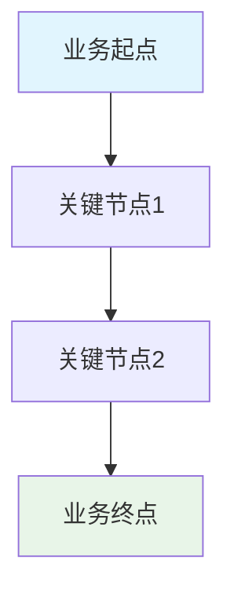
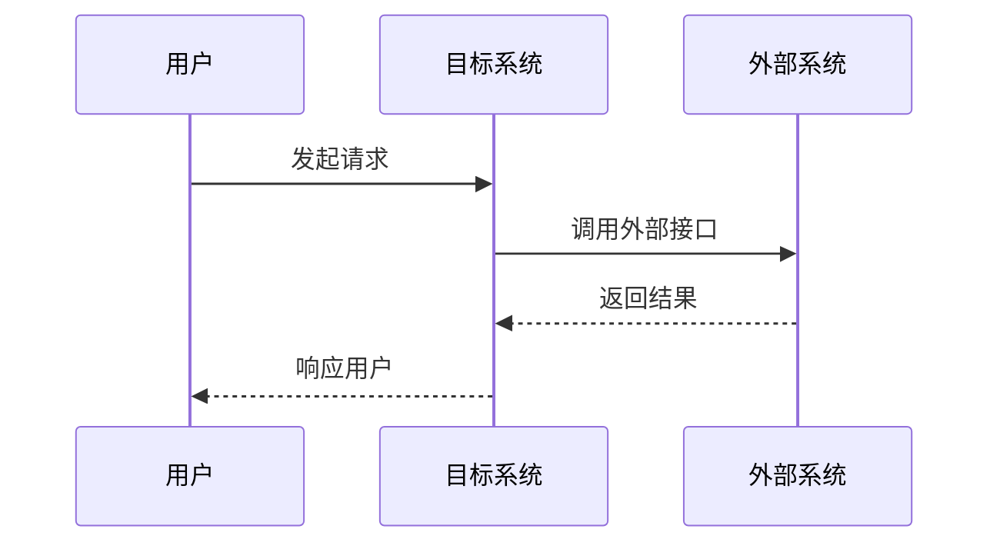
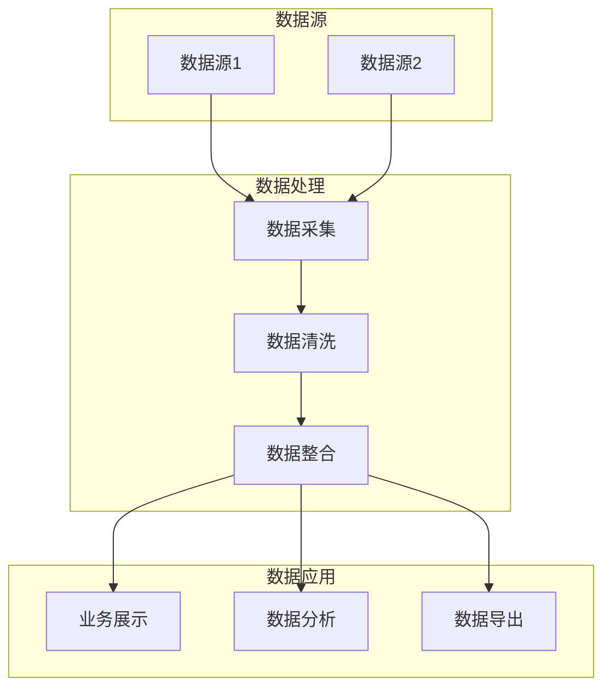
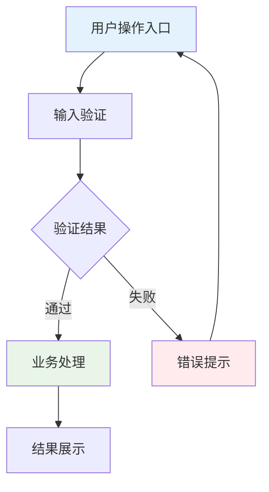

# 系统需求文档模板（V2.0版）

| 修订目录 | | | |
| --- | --- | --- | --- |
| 修订时间 | 修订版本 | 修订人 | 修订说明 |
| YYYY.MM.DD | V1.0 | 【填写修订人】 | 新增版本V1.0 |
| YYYY.MM.DD | V1.1 | 【填写修订人】 | 【填写修订说明】 |

## **一、背景**

### 1.1 项目背景
【阐述项目产生的业务背景，包括但不限于：】
- 当前业务现状和面临的挑战
- 市场环境或技术环境的变化
- 企业战略目标与本项目的关系
- 项目启动的直接原因

### 1.2 建设目标
【明确项目要达到的具体目标，建议采用SMART原则：】
- 主要目标：【描述核心目标】
- 次要目标：【描述辅助目标】
- 成功标准：【定义项目成功的量化指标】

### 1.3 项目范围
【明确项目的边界和范围：】
- 包含范围：【明确本期项目要解决的问题】
- 不包含范围：【明确不在本期考虑的内容】
- 后续规划：【简述未来版本的规划】

## **二、业务名词**

【阐述文档中用到的业务名词，确保团队对关键概念理解一致】

| 业务名词 | 名词说明 | 使用场景 | 相关系统 |
| :--- | :--- | :--- | :--- |
| 【术语1】 | 【详细定义和解释】 | 【在哪些业务场景中使用】 | 【涉及哪些系统】 |
| 【术语2】 | 【详细定义和解释】 | 【在哪些业务场景中使用】 | 【涉及哪些系统】 |

## **三、流程图**

【根据实际情况，梳理对应的流程图，建议至少包含以下三个维度】

### **1、业务流程图**

【输出内容要求：描述端到端的业务流程，使用 flowchart 格式的 mermaid 图】

**流程说明：**
- 【对每个关键节点进行详细说明】
- 【说明流程中的决策点和分支逻辑】
- 【标注异常处理路径】

### **2、系统流程图**

【输出内容要求：描述系统间交互流程，使用 sequenceDiagram 格式的 mermaid 时序图】

**交互说明：**
- 【描述各系统的职责和边界】
- 【说明数据流向和处理逻辑】
- 【标注关键的同步/异步处理点】

### **3、数据流程图**

【输出内容要求：描述数据流转过程，使用 flowchart 格式的 mermaid 图】

**数据说明：**
- 【描述各数据源的特点和更新频率】
- 【说明数据处理的业务规则】
- 【标注数据质量要求和异常处理】

## **四、功能需求清单**

【输出内容要求：功能模块需要作为一个完整的功能版块，下面可以有多个功能点】

| 功能模块 | 功能目的 | 模块功能点 | 优先级 | 复杂度 | 预估工期 |
| :--- | :--- | :--- | :--- | :--- | :--- |
| 【模块名称】 | 提供XXX功能，解决XXX问题，支持XXX场景 | 功能点1 功能点2 功能点3 | P0/P1/P2 | 高/中/低 | X人天 |
| 【示例：用户管理】 | 提供用户注册登录功能，解决身份认证问题，支持权限控制场景 | 用户注册 用户登录 权限验证 密码找回 | P0 | 中 | 5人天 |

**优先级说明：**
- P0：核心功能，必须实现
- P1：重要功能，优先实现
- P2：辅助功能，资源允许时实现

**复杂度评估：**
- 高：技术难度大，需要深入研究或架构设计
- 中：常规开发，需要一定的业务理解
- 低：简单功能，可快速实现

## **五、功能性需求说明**

【输出内容要求：根据功能需求清单中的功能模块，将功能作为一个完整的功能板块来做功能性需求说明】

### 【功能模块名称】

#### （1）功能流程

【输出内容要求：针对该功能的整体操作交互流程，用流程图输出，使用 mermaid】

**流程说明：**
- 【描述用户操作的关键步骤】
- 【说明系统响应和状态变化】
- 【标注异常情况的处理方式】

#### （2）交互说明

【输出内容要求：针对该功能的相关交互细节进行补充说明】

**界面交互：**
- 【描述页面布局和组件安排】
- 【说明用户操作方式和反馈机制】
- 【标注特殊的交互规则】

**操作限制：**
- 【描述操作权限要求】
- 【说明并发操作的限制】
- 【标注数据安全相关的限制】

**响应反馈：**
- 【描述操作成功的反馈方式】
- 【说明错误情况的提示信息】
- 【标注加载状态的显示规则】

#### （3）字段说明

【输出内容要求：对每个表单、列表进行字段说明，说明格式如下】

| 字段名称 | 类型 | 取值范围/枚举值 | 是否必填 | 默认值 | 业务含义 | 备注 |
| --- | --- | --- | --- | --- | --- | --- |
| 【字段1】 | 文本/数值/日期/枚举/布尔 | 【具体的取值范围或枚举值】 | 是/否 | 【默认值】 | 【业务含义说明】 | 【特殊说明】 |
| 【字段2】 | 文本/数值/日期/枚举/布尔 | 【具体的取值范围或枚举值】 | 是/否 | 【默认值】 | 【业务含义说明】 | 【特殊说明】 |

**字段类型说明：**
- 文本：字符串类型，需标注最大长度
- 数值：整数或小数，需标注取值范围
- 日期：日期时间类型，需标注格式要求
- 枚举：固定选项，需列出所有可选值
- 布尔：true/false类型，需说明含义

#### （4）业务规则

【描述该功能相关的业务规则和约束条件】

**数据规则：**
- 【描述数据验证规则】
- 【说明数据关联关系】
- 【标注数据一致性要求】

**操作规则：**
- 【描述操作前置条件】
- 【说明操作后置处理】
- 【标注操作权限要求】

**异常规则：**
- 【描述异常情况的判断条件】
- 【说明异常处理的业务逻辑】
- 【标注异常恢复的处理方式】

## **六、非功能性需求说明**

### 1. 性能需求
- **响应时间要求**：
  - 页面加载时间：≤ X秒
  - 查询响应时间：≤ X秒
  - 事务处理时间：≤ X秒
- **吞吐量要求**：
  - 并发用户数：≥ X个
  - 每秒事务数：≥ X TPS
  - 每日事务量：≥ X万笔
- **资源利用率**：
  - CPU利用率：≤ X%
  - 内存利用率：≤ X%
  - 磁盘IO：≤ X MB/s

### 2. 可用性需求
- **系统可用性**：≥ XX%（如99.9%）
- **故障恢复时间**：≤ X小时
- **数据备份策略**：【描述备份频率和保留期限】
- **容灾要求**：【描述容灾级别和切换时间】

### 3. 安全性需求
- **身份认证**：【描述认证方式和强度要求】
- **访问控制**：【描述权限管理和控制粒度】
- **数据加密**：【描述传输和存储加密要求】
- **审计日志**：【描述日志记录和审计要求】
- **安全防护**：【描述防护措施和安全标准】

### 4. 兼容性需求
- **浏览器兼容**：【列出支持的浏览器版本】
- **操作系统兼容**：【列出支持的操作系统】
- **移动端兼容**：【说明移动端支持情况】
- **第三方兼容**：【说明与第三方系统的兼容要求】

### 5. 扩展性需求
- **用户规模扩展**：支持从X万用户扩展到Y万用户
- **数据规模扩展**：支持从X万条数据扩展到Y万条数据
- **功能模块扩展**：【描述架构的可扩展性设计】
- **地域扩展**：【描述多地域部署的支持能力】

### 6. 维护性需求
- **代码质量**：【描述代码规范和质量要求】
- **文档要求**：【描述技术文档和用户文档要求】
- **监控体系**：【描述系统监控和告警要求】
- **部署运维**：【描述自动化部署和运维要求】

### 7. 异常场景处理需求
- **网络异常**：【描述网络中断、超时等异常的处理策略】
- **数据异常**：【描述数据错误、丢失等异常的处理策略】
- **系统异常**：【描述系统故障、宕机等异常的处理策略】
- **用户异常**：【描述用户误操作、权限异常等的处理策略】
- **并发异常**：【描述并发冲突、死锁等异常的处理策略】
- **资源异常**：【描述资源耗尽、限流等异常的处理策略】
- **业务异常**：【描述业务逻辑错误、状态异常等的处理策略】

## **七、接口需求说明**

【如果涉及系统集成，需要说明接口要求】

### 7.1 对外提供接口

| 接口名称 | 接口类型 | 接口描述 | 调用方 | 数据格式 | 性能要求 |
| :--- | :--- | :--- | :--- | :--- | :--- |
| 【接口1】 | REST/SOAP/RPC | 【接口功能描述】 | 【调用系统】 | JSON/XML | 【响应时间要求】 |

### 7.2 调用外部接口

| 接口名称 | 提供方 | 接口描述 | 调用频率 | 超时处理 | 异常处理 |
| :--- | :--- | :--- | :--- | :--- | :--- |
| 【接口1】 | 【外部系统】 | 【接口功能描述】 | 【每分钟X次】 | 【X秒超时】 | 【异常处理策略】 |

## **八、数据需求说明**

【如果涉及数据处理，需要说明数据要求】

### 8.1 数据模型

| 实体名称 | 实体描述 | 主要属性 | 关联关系 | 存储要求 |
| :--- | :--- | :--- | :--- | :--- |
| 【实体1】 | 【实体功能描述】 | 【关键字段列表】 | 【与其他实体的关系】 | 【存储时长和规模】 |

### 8.2 数据质量

- **数据准确性**：【描述数据准确性要求】
- **数据完整性**：【描述数据完整性要求】
- **数据一致性**：【描述数据一致性要求】
- **数据时效性**：【描述数据更新频率要求】

### 8.3 数据迁移

【如果涉及数据迁移，需要说明迁移策略】

- **迁移范围**：【描述需要迁移的数据】
- **迁移策略**：【描述迁移方式和步骤】
- **数据校验**：【描述迁移后的数据校验方法】
- **回滚方案**：【描述迁移失败时的回滚策略】

## **九、部署运维需求**

### 9.1 部署环境

- **硬件要求**：【描述服务器配置要求】
- **软件环境**：【描述操作系统、中间件版本要求】
- **网络要求**：【描述网络带宽、安全组配置】
- **存储要求**：【描述存储容量、备份要求】

### 9.2 运维要求

- **监控指标**：【列出关键监控指标】
- **告警机制**：【描述告警规则和通知方式】
- **日志管理**：【描述日志级别和归档策略】
- **备份恢复**：【描述备份策略和恢复流程】

## **十、验收标准**

### 10.1 功能验收

- **测试范围**：【描述需要测试的功能模块】
- **测试用例**：【说明测试用例的覆盖率要求】
- **验收标准**：【定义功能验收的通过标准】

### 10.2 性能验收

- **性能指标**：【列出需要验证的性能指标】
- **测试环境**：【描述性能测试的环境要求】
- **验收标准**：【定义性能验收的通过标准】

### 10.3 安全验收

- **安全测试**：【描述安全测试的范围和方法】
- **漏洞评估**：【说明安全漏洞的评估标准】
- **验收标准**：【定义安全验收的通过标准】

---

## **附录**

### A. 参考文档

- 【列出相关的参考文档】

### B. 术语对照表

| 中文术语 | 英文术语 | 缩写 | 说明 |
| :--- | :--- | :--- | :--- |
| 【中文】 | 【English】 | 【缩写】 | 【说明】 |

### C. 变更记录

| 变更日期 | 变更内容 | 变更原因 | 影响范围 | 变更人 |
| :--- | :--- | :--- | :--- | :--- |
| YYYY.MM.DD | 【变更详情】 | 【变更原因】 | 【影响的模块】 | 【变更人】 |

---

**文档编制说明：**
1. 本模板适用于中大型系统的需求文档编制
2. 各章节可根据项目实际情况进行调整和裁剪
3. 所有流程图建议使用Mermaid格式，便于版本控制和在线展示
4. 字段说明表格必须完整填写，确保开发团队理解准确
5. 非功能性需求必须量化，避免模糊表述
6. 建议定期回顾和更新需求文档，保持文档的时效性

